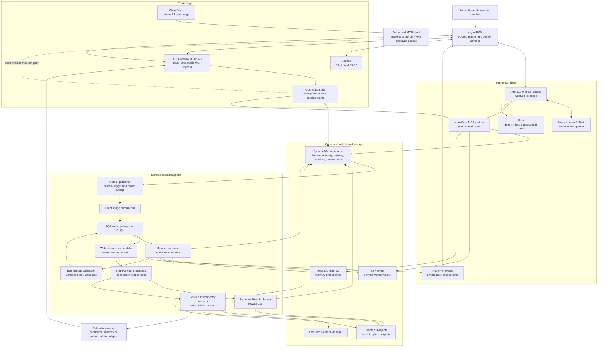
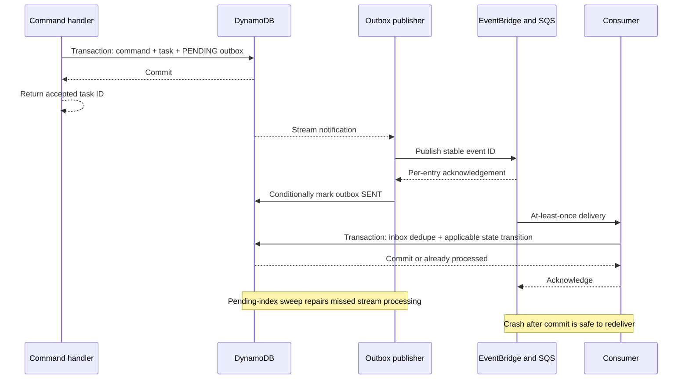
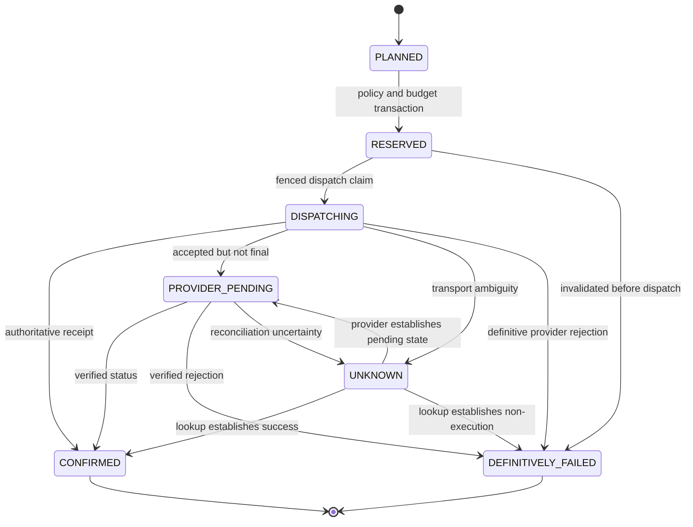
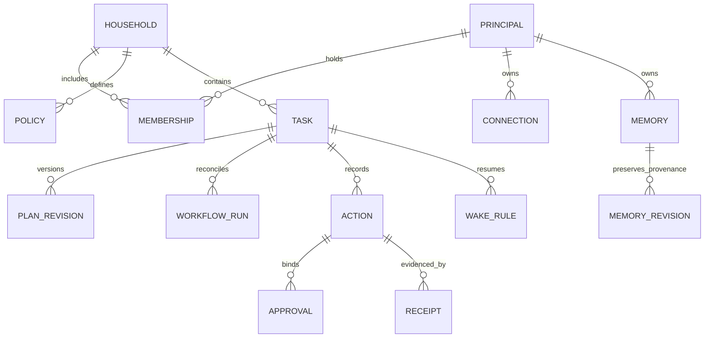

# Koyori — Technical Design Document

**Project:** Koyori, the persistent personal agent for the home  
**Context:** Amazon App Dev 2026 — Alexa+ experience, with a working MCP integration surface and an explicitly identified web voice simulator  
**Document version:** 1.0  
**Reference date:** 4 October 2026  
**Architecture status:** Proposed target design; this document does not assert that the system is already implemented, deployed, certified, or benchmarked.  
**Document language:** English

> **Architecture in one sentence:** A channel-independent personal-agent core combines bounded Amazon Bedrock reasoning, deterministic authorization, durable event-driven task execution, and provenance-backed memory; a low-latency voice runtime and a standards-based MCP interface expose that core without making a conversation session responsible for business continuity.

## Contents

- [1. Scope, source basis, and integration boundaries](#1-scope-source-basis-and-integration-boundaries)
- [2. Architectural principles and service objectives](#2-architectural-principles-and-service-objectives)
- [3. System architecture](#3-system-architecture)
- [4. Technology stack and AWS service selection](#4-technology-stack-and-aws-service-selection)
- [5. Frontend and voice interaction design](#5-frontend-and-voice-interaction-design)
- [6. Agent core and model routing](#6-agent-core-and-model-routing)
- [7. Durable task execution and asynchronous processing](#7-durable-task-execution-and-asynchronous-processing)
- [8. External actions, authorization, and financial correctness](#8-external-actions-authorization-and-financial-correctness)
- [9. Connector contracts and provider synchronization](#9-connector-contracts-and-provider-synchronization)
- [10. Memory, provenance, and contextual retrieval](#10-memory-provenance-and-contextual-retrieval)
- [11. Data model and storage implementation](#11-data-model-and-storage-implementation)
- [12. API contracts and inter-service communication](#12-api-contracts-and-inter-service-communication)
- [13. Authentication, authorization, and secret management](#13-authentication-authorization-and-secret-management)
- [14. Security, privacy, and data protection](#14-security-privacy-and-data-protection)
- [15. Real-time updates, caching, and performance optimization](#15-real-time-updates-caching-and-performance-optimization)
- [16. Resilience, error handling, and recovery](#16-resilience-error-handling-and-recovery)
- [17. Observability and operational controls](#17-observability-and-operational-controls)
- [18. Infrastructure as Code, environments, and deployment](#18-infrastructure-as-code-environments-and-deployment)
- [19. Scaling strategy and cost model](#19-scaling-strategy-and-cost-model)
- [20. Technical verification and acceptance criteria](#20-technical-verification-and-acceptance-criteria)
- [21. Architecture decisions and principal risks](#21-architecture-decisions-and-principal-risks)
- [22. References and evidence boundary](#22-references-and-evidence-boundary)

## 1. Scope, source basis, and integration boundaries

### 1.1 Source-derived requirements

The supplied concept note, **“Koyori — L’agent personnel de la maison,” dated 4 October 2026**, is the product basis. It specifies a voice-first household agent, continuity between conversations, coordinated cross-service actions, four distinct memory categories, adjustable autonomy, and separation of private and shared household information. Its examples assume connected accounts and appropriate permissions; they are not evidence that merchant or Alexa integrations already exist.[^concept]

This design translates those requirements into technical contracts. AWS selections, schemas, numerical limits, failure policies, and deployment topology below are **design decisions**, not facts asserted by the concept note. Service capabilities and integration restrictions are supported by the references at the end of this document. Numerical objectives are engineering acceptance targets, not measured results.

| Concept requirement | Technical realization |
|---|---|
| Voice without a mandatory chat interface | Browser voice client, native speech-to-speech runtime, optional visual cards, and a channel adapter boundary |
| Tasks continue after conversation ends | DynamoDB task state, transactional outbox, durable workflow runs, scheduled and event-driven wake-ups |
| Coordinate several domains | One bounded coordinator, typed specialist functions, dependency-checked plans, registered connector capabilities |
| Recall conversations, preferences, commitments, and procedures | Separate canonical representations; semantic retrieval supplements, but never replaces, authoritative records |
| Adjustable autonomy | Versioned consent and policy records, spending reservations, exact-action approvals, deterministic dispatch gates |
| Personal and household context remain distinct | Authenticated principal, explicit sharing, server-generated retrieval scopes, per-object authorization |
| Adapt an existing plan | Optimistic concurrency, stable commercial-intent identifiers, revision-bound approvals, reconciliation before amendment |
| Confirm real outcomes rather than intentions | Provider receipts and action ledger states determine completion; generated text cannot establish success |

### 1.2 Actual Amazon integration boundary

The hackathon FAQ states that participants do not receive access to the Alexa+ preview Category SDK, MCP toolkit, CLI, or Amazon Web Simulator. It allows a self-hosted MCP server or Agent Skill demonstrated through a participant-built frontend; a physical Alexa device is not required. Consequently, the reference deployment is a **real backend and MCP server exercised through Koyori’s own clearly labeled voice simulator**, not a claimed native Alexa+ integration.[^hackathon-faq]

The channel boundary accepts normalized authenticated commands and returns speech intents, visual cards, and task references. An approved native Alexa integration must implement that boundary using the actual partner contract. No undocumented Alexa message format, cross-skill memory access, third-party wake-word interception, arbitrary proactive Alexa speech, or access to Amazon checkout is assumed. Native-channel capabilities remain disabled unless a compatible, authorized integration is configured.

### 1.3 Connector scope and capability truthfulness

The architecture supports calendar, meals and shopping, travel, personal services, and smart-home adapters. Availability is a **runtime capability registry**, not a claim that every domain has a usable public API.

The reference technical implementation has these concrete integration types:

- **Calendar:** an OAuth-connected Google Calendar adapter, with selected-calendar read access; writing requires a separately granted capability and sufficient provider scope.
- **Commerce:** a deterministic grocery/meal sandbox implementing quote, create, lookup, amend, cancel, and webhook contracts. Sandbox transactions are visibly labeled and cannot spend money.
- **Other domains:** the same typed adapter interface, returning `CAPABILITY_UNAVAILABLE` or an explicit user handoff when no authorized provider is configured. The model cannot manufacture a connector.

A live commerce adapter is enabled only when the provider contract supports authorized transactions and safe reconciliation. No browser scraping, captured consumer credentials, unofficial merchant endpoint, or general-purpose computer-control agent is an execution dependency.

### 1.4 Technical exclusions

The target does not contain model training infrastructure, an always-listening microphone service, voice-biometric identification, an autonomous shell, a generic browser automation worker, direct card-data processing, or an active-active multi-region transaction system. These exclusions preserve an auditable authorization boundary and bounded operating cost. They do not remove the product’s persistent-task or multi-domain abstractions.

## 2. Architectural principles and service objectives

### 2.1 Non-negotiable invariants

1. **The model proposes; deterministic code authorizes and executes.** A prompt, preference, retrieved document, or tool response cannot grant permission.
2. **A conversation is not a workflow.** Closing a socket, renewing a model stream, or restarting a container cannot erase an accepted task.
3. **Accepted means durably recorded.** A successful command acknowledgement follows the atomic write of the command/task and its outbox event.
4. **An external outcome needs external evidence.** A submitted request, HTTP timeout, or model statement is not proof of a purchase, cancellation, or delivery.
5. **Unknown outcomes remain unknown until reconciled.** An uncertain payment or booking is never blindly repeated.
6. **Authorization is tenant- and object-specific.** Household membership does not imply access to another member’s private memories or provider account.
7. **Learning cannot increase autonomy.** Only an authenticated, authorized policy change can expand spending, sharing, or connector permissions.
8. **Every expensive loop is bounded.** Model calls, tool calls, parallelism, retries, voice sessions, and outstanding tasks have explicit limits.
9. **Derived data is disposable.** Search vectors and caches can be rebuilt from canonical, authorized records; they cannot override a correction or deletion.
10. **Safety work survives a spending cutoff.** Reconciliation, cancellation requests, and delivery of important failure notices are prioritized over new agent reasoning.

### 2.2 Performance and reliability objectives

Targets apply to the reference regional deployment under the declared test workload. They exclude the provider’s fulfillment time and must be reported separately for cold and warm application paths. Client-to-region network delay is included in client-observed voice metrics, not hidden inside a server-only number.

| Workload | Target | Measurement boundary / qualification |
|---|---|---|
| Warm authenticated metadata read | p95 ≤ 300 ms server-side | API ingress to serialized response; excludes model calls |
| Durable command acceptance | p95 ≤ 600 ms server-side | Includes authorization, conditional transaction, and task identifier; does not wait for planning |
| Warm voice connection readiness | p95 ≤ 1.5 s | Session request to authenticated `session.ready`; not a guarantee for cold runtime provisioning |
| First meaningful conversational audio | p95 ≤ 2.0 s after end of utterance | Normal read-only turn, warm session, tested network; filler audio does not satisfy the objective |
| Interruption response | Client playback stops within 150 ms | Local generation-buffer flush; cancellation of business actions is a separate operation |
| Canonical context assembly | p95 ≤ 200 ms server-side | Parallel key-based reads and bounded cache lookups; semantic search measured separately |
| Semantic memory lookup | p95 ≤ 700 ms server-side | Embedding, filtered vector query, and canonical rehydration; not required for every turn |
| Activity update visibility | p95 ≤ 2 s after durable commit | Under normal queue load; durable catch-up remains available after missed pushes |
| Scheduled wake-up | Minute-level precision | Scheduler plus queue delay; not a real-time alarm or a provider delivery guarantee |
| Control-plane availability | 99.9% monthly objective | Authenticated command acceptance and task reads; report upstream dependency incidents separately |
| Accepted-task integrity | No acknowledged task without a durable record and recoverable wake intent | Verified by transaction, outbox, crash, and restore tests; not a zero-loss regional disaster guarantee |

A timeout should produce a durable task reference or an explicit failure, not an ambiguous “done.” When capacity is exhausted, the system rejects new voice admission or new expensive work with retry guidance while preserving task-status access and recovery processing.

## 3. System architecture

### 3.1 Regional architecture



Arrows represent logical integration paths, not unrestricted IAM permissions. For example, the planner can read approved context and write candidate-plan objects, but it cannot decrypt provider credentials or commit an external action. The webhook route has a dedicated ingestion role rather than the permissions of the full control API.

### 3.2 Deployment region and locality

The reference hackathon cell is **`us-east-1`**, with synthetic demonstration data. It uses region-local storage, Nova 2 Sonic in that region, and the **US geographic inference profile** for Nova 2 Lite. The latter may process inference in more than one US region. This is **not an EU-resident deployment**, even when the interface is French or a household uses `Europe/Paris`.

An environment manifest fixes the allowed storage region, inference profile, locale set, and provider domains. Startup rejects a model/profile that violates the environment’s locality policy. Global inference profiles are disabled. An EU-locality configuration is a distinct verified deployment profile, not an automatic cross-region fallback. The current Nova 2 Sonic model card includes `eu-north-1`; the design does not claim that European speech deployment is unavailable.[^sonic-card][^lite-card]

Managed services provide their own regional availability characteristics; the application remains dependent on one regional cell. A region-wide incident triggers a controlled restore/reconciliation procedure, not speculative simultaneous dispatch from a second region. The reference deployment does not include cross-region backup replication; a full regional interruption can therefore require waiting for regional service restoration. PITR primarily addresses recoverable data loss/corruption and is not an independent regional failover system.

### 3.3 Why a modular codebase rather than a service mesh

One repository contains shared schemas, authorization logic, domain state machines, and connector interfaces. Runtime separation follows **security and latency boundaries**, not every business noun:

| Deployable | Responsibility | Explicitly prohibited |
|---|---|---|
| Web client | Microphone, playback, visual state, authenticated controls | Provider credentials; autonomous offline writes |
| Control API / MCP ingress | OAuth validation, commands, approvals, session admission, external MCP proxy | Generating provider success; unrestricted model execution |
| Voice runtime | Audio transport, bounded conversational context, read/delegate tools | Direct merchant writes; policy expansion; credential decryption |
| MCP runtime | Stable tool registry, authorized domain reads and command submission | User-defined tools; arbitrary URL execution |
| Planner worker | Bounded plan generation and specialist reasoning | Provider tokens; action-ledger commits; approval creation on behalf of users |
| Workflow controller | Task transitions, run fencing, dependency handling | Treating model output as authoritative state |
| Connector workers | Fresh policy checks, token refresh, provider calls, receipt verification | Cross-owner connection use; blind retry of unknown outcomes |
| Projection workers | Outbox publication, memory index, activity feed, notifications, provider synchronization | Expanding source visibility or permissions |

Small worker functions can share a build artifact while retaining separate handlers and execution roles. This avoids operationally expensive EKS clusters, service meshes, Kafka brokers, and per-specialist always-on containers.

## 4. Technology stack and AWS service selection

### 4.1 Application stack

| Layer | Selected technology | Rationale and trade-off |
|---|---|---|
| Frontend | React 19, TypeScript, Vite, semantic HTML, responsive PWA | Static delivery, small deployment surface, typed UI contracts. No SSR framework because authenticated voice and task views do not require server-rendered SEO. |
| Browser audio | Web Audio API, AudioWorklet, native WebSocket | Explicit buffering and interruption control. More transport code than a fully managed voice widget; avoids depending on preview Alexa UI tools. |
| Backend | Python 3.12, Pydantic, AWS SDK, async HTTP client | Direct fit for agent and MCP libraries; clear data validation. Short-lived synchronous control functions stay small to limit cold-start and import overhead. |
| Agent SDK | Strands Agents SDK for bounded reasoning and typed specialist calls | AWS-compatible orchestration in ordinary code. It is not the durable workflow engine or the authorization system.[^strands] |
| MCP implementation | Official Python MCP SDK / FastMCP, Streamable HTTP, stateless tools | Interoperable interface without inventing an agent RPC protocol. Public OAuth admission remains Koyori’s explicit responsibility.[^agentcore-mcp][^mcp-transport] |
| Contract source | Versioned JSON Schema and OpenAPI 3.1; generated TypeScript types; Pydantic adapters | Shared validation and compatibility testing. Schema generation is checked in CI rather than trusting independent handwritten models. |
| Infrastructure | AWS CDK v2 in TypeScript, CloudFormation | Reproducible service wiring and least-privilege roles; lower-level constructs are acceptable where managed-service coverage requires them. |
| Packaging | Locked Python/Node dependencies; immutable container digests for AgentCore; Lambda artifacts | Reproducibility over “latest” dependency resolution. Runtime architecture is pinned only after compatibility tests. |

All package patch versions and container bases are locked in the repository. The named language/framework versions are architecture selections, not claims that they are the newest releases.

### 4.2 AWS service responsibility matrix

| AWS service | Role in Koyori | Why selected / principal alternative |
|---|---|---|
| S3 + CloudFront | Static application delivery and separate private object storage | Cheap, cacheable static hosting without an application server. Private object access uses server authorization, not the public asset distribution. |
| Amazon Cognito | User authentication, OAuth authorization code flow, PKCE, application scopes | Avoids operating an identity server. Provider OAuth connections are separate identities and credentials. |
| API Gateway HTTP API | REST controls, OAuth callbacks, provider webhook admission, public MCP proxy | Low-overhead managed HTTP ingress. REST API-specific features are not assumed to exist on HTTP API. |
| AWS Lambda | Control handlers, bounded planning, connector execution, projections | No idle application server. Unsuitable for an open-ended voice socket; that workload uses AgentCore. |
| Bedrock AgentCore Runtime | Two isolated deployments: voice bridge and MCP tool server | Managed agent/session transport rather than operating Fargate, an ALB, and WebSocket scaling. Adds a service dependency and runtime metering.[^agentcore-ws][^agentcore-mcp] |
| Amazon Bedrock | Nova speech/reasoning and Titan embeddings | Common IAM, model access, and usage accounting. Model APIs and supported features differ and are handled explicitly. |
| Amazon Polly | Exact transactional and approval narration | Deterministic wording from validated state. Adds a synthesis request but prevents a model from inventing a transaction outcome in this branch.[^polly] |
| Step Functions Standard | Durable, observable, finite task reconciliation runs | Explicit transitions and managed recovery instead of a custom orchestration service. More transition overhead than an in-process loop; therefore not used on each audio frame or token.[^step-functions] |
| DynamoDB on-demand | Canonical domain state, memory records, outbox, sessions, encrypted connection envelopes | Predictable key access and conditional transactions without database connection pools. Joins, ad hoc reporting, and schema migration require deliberate application design. |
| S3 Vectors | Derived semantic memory index | No provisioned search cluster. Chosen for bounded recall rather than large-scale hybrid analytics or strict single-digit-millisecond search.[^s3-vectors] |
| EventBridge | Domain-event routing and decoupled consumers | Simple fan-out and event filtering; not an ordered transaction log. |
| SQS | Buffering, backpressure, consumer retries, DLQs | Separates slow/failing providers from command acceptance. At-least-once delivery requires application idempotency.[^lambda-sqs] |
| EventBridge Scheduler | Due-time and recurrence wake-ups | Managed timers instead of continuously polling every task. Precision is minute-level, and DST behavior must be handled explicitly.[^scheduler] |
| AppSync Events | Authenticated per-user activity change hints | Managed real-time subscriptions without maintaining a custom connection registry. Canonical history still lives in DynamoDB.[^appsync-handlers] |
| KMS + Secrets Manager | Encryption boundaries and application-level secrets | Managed rotation/audit for a small number of secrets; per-user OAuth token envelopes are stored in DynamoDB to avoid one paid secret per connection. |
| CloudWatch + AWS-native tracing | Logs, low-cardinality metrics, alarms, distributed traces | One operational surface. Retention and sampling are necessary to prevent observability costs from dominating. |
| ECR, IAM, ACM, Route 53 | Immutable runtime images, service roles, TLS certificates, DNS | Standard managed deployment foundations rather than bespoke credential or certificate handling. |

### 4.3 Services intentionally not required

The reference cell does not use a provisioned Redis/ElastiCache cluster, DAX, OpenSearch Serverless, Aurora, an ALB, a NAT gateway, or a Kubernetes cluster. DynamoDB access patterns and small scoped caches cover the required reads; S3 Vectors covers derived semantic recall.

AgentCore Memory, Gateway, Identity, and Policy are not required in this design. Their capabilities are not disputed: they are omitted because Koyori already needs a canonical, editable memory model, a narrow registered tool interface, provider-specific credential control, and financial invariants checked in DynamoDB transactions. Adding a second authority for these concerns would increase reconciliation and policy-consistency work.

The selected AgentCore deployment is the **serverless consumption-based runtime**, not an EC2-backed Runtime Instances configuration. Its CPU/memory, initialization, and session overhead remain cost drivers; “serverless” does not mean that an open idle session is free.[^agentcore-pricing]

## 5. Frontend and voice interaction design

### 5.1 Client responsibilities

The PWA provides a voice-first home screen, task/activity cards, approvals, memory correction, connector setup, and household privacy controls. Text input is an equivalent command channel and an accessibility fallback, not a required step in the voice workflow.

The application obtains microphone permission only after an explicit interaction. It displays recording and playback state, exposes a persistent stop control, and releases the microphone when the session ends. It does not implement an always-listening cloud wake word or pretend to be an Amazon-certified Alexa surface.

Authentication tokens are kept in memory where practical, never in application logs or URLs. The service worker caches versioned static assets only; it does not cache authenticated API responses, approvals, provider tokens, speech audio, or private conversation content. Offline mode can display a disconnected shell but cannot silently queue a purchase for later execution.

### 5.2 Session admission and audio path

```mermaid
sequenceDiagram
    participant C as Browser
    participant A as Control API
    participant D as DynamoDB
    participant V as Voice runtime
    participant N as Nova 2 Sonic
    participant M as MCP core

    C->>A: POST /v1/sessions with access token
    A->>D: Check membership, limits and consent; store ticket hash
    A-->>C: Session ID, short-lived signed WSS URL, one-use ticket
    C->>V: WSS handshake, then session.start with ticket
    V->>D: Atomically consume ticket bound to runtime session
    V->>N: Open bidirectional speech stream
    V-->>C: session.ready with negotiated audio format
    C->>V: Sequenced microphone audio
    V->>N: Audio events
    N-->>V: Transcript and permitted tool request
    V->>M: Read or submit command with server-held actor grant
    M->>D: Authorized read or atomic command plus outbox write
    M-->>V: Facts or accepted task ID, not invented completion
    V-->>C: Speech, transcript and task reference
    C->>V: interrupt or session.stop
    V->>N: Stop output or close model stream
    Note over D,M: Accepted tasks remain independent of this connection
```

AgentCore supports bidirectional WebSocket invocation and presigned connection URLs. The control service uses this mechanism to issue a **30-second connection URL** and a separate one-use bootstrap ticket. The ticket is a Koyori security layer, not a feature assumed to be provided by the speech model.[^agentcore-ws]

The ticket is 256-bit random material, stored only as a hash, and bound to principal, household, logical conversation, runtime session ID, expiration, and allowed channel mode. The voice runtime consumes it atomically before any private read, model invocation, or tool call. Reconnect creates a new ticket and runtime session while retaining the authorized logical conversation. A runtime session identifier is never treated as proof of identity.

Reference admission limits require bootstrap completion within five seconds, end an inactive voice session after sixty seconds, and cap one admitted interactive session at ten minutes. Heartbeats alone do not count as user activity. The logical conversation and accepted tasks survive these resource limits; another admitted session can resume them.

A stolen URL can potentially cause a connection attempt until it expires; it cannot obtain context without the ticket. URL query strings, tickets, and delegation grants are excluded from access logs and telemetry. Origin checks, connection admission limits, short bootstrap deadlines, and explicit termination contain this residual exposure.

### 5.3 Audio transport and interruption

The client AudioWorklet resamples microphone audio to the negotiated input format, with a reference configuration of mono signed PCM16 at 16 kHz. Output sample rate is supplied by the server from the selected speech configuration; the browser does not assume that input and output rates match. The adapter validates the actual supported model format at startup.

JSON messages carry session and turn control. Binary audio frames carry an eight-byte header—unsigned 32-bit little-endian sequence number followed by unsigned 32-bit generation identifier—then the negotiated PCM payload. Input and output sequence spaces are independent. A protocol version and format are negotiated before audio is accepted.

The browser bounds its playback buffer, sends backpressure information, and drops superseded output generations on interruption. If upload backpressure exceeds the configured buffer budget, it stops recording and reports the transport interruption rather than silently losing part of an instruction. Audio frames are not replayed after reconnect. Only final transcripts with stable turn IDs enter durable memory; interim hypotheses are not durable instructions.

Nova 2 Sonic uses `InvokeModelWithBidirectionalStream`, not the Bedrock Converse API. Its model stream has an eight-minute connection limit. The bridge therefore renews a stream before that limit, preferably between turns, restoring a bounded authorized context summary. A long-lived logical conversation is not one indefinitely open model stream.[^sonic-card][^sonic-guide]

### 5.4 Transactional speech and truthfulness

Nova conversational output can discuss read-only context and acknowledge that work was accepted. It cannot authorize an action. The transaction/approval branch uses **validated state-to-speech templates synthesized with Polly**, including exact amounts, provider names, and status distinctions such as “awaiting confirmation,” “confirmed,” and “outcome not yet known.”

When this branch is active, the runtime suppresses generative completion narration and emits only the selected authoritative template. The user may still interrupt playback. Interruption never means “cancel the merchant order”; cancellation is a separate authenticated command.

Nova 2 Sonic does not advertise native Bedrock Guardrails support in its model card. This design therefore does not claim that a Bedrock guardrail automatically inspects or sanitizes the streaming audio. Deterministic tool authorization, input/output handling, and transaction narration remain separate controls.[^sonic-card]

Free-form speech can still contain model errors, including errors before a tool branch is recognized. Tests must measure this residual risk. The activity card and canonical task/receipt state remain authoritative; generated wording can never advance a ledger state.

### 5.5 Shared-device identity

A browser authenticated as one person is not evidence that every nearby speaker is that person. A shared household voice session defaults to shared information and low-risk capabilities. Reading private memory requires an explicitly selected authenticated personal mode. New spending permissions, sensitive account linking, and out-of-policy financial actions require an authenticated approval surface with fresh authorization, not a spoken “yes” from an unidentified person.

## 6. Agent core and model routing

### 6.1 Model configuration

| Purpose | Configured model / interface | Design constraints |
|---|---|---|
| Interactive speech | `amazon.nova-2-sonic-v1:0`; bidirectional streaming | No direct provider execution; stream renewal; bounded context; transaction speech gate |
| Planning and bounded specialist reasoning | `us.amazon.nova-2-lite-v1:0`; Bedrock Converse through Strands | US geographic profile; reasoning disabled or low by default; strict tool registry and output validation |
| Memory embeddings | `amazon.titan-embed-text-v2:0`; InvokeModel; 512-dimensional normalized float vectors | Versioned embedding profile; semantic quality tested in both English and French |
| Authoritative speech | Polly SynthesizeSpeech | Template-generated text only for transactional status and approval wording |

Nova 2 Lite supports Converse and tool calling, but its model card does not advertise the managed Structured Outputs feature. Koyori uses schema-constrained tool definitions plus application validation and bounded repair; it does not claim guaranteed JSON generation. Titan V2 supports the selected 512-dimensional embedding configuration.[^lite-card][^titan-parameters]

Model IDs, inference profile, prompt version, schema version, sampling parameters, and token ceilings are recorded with each plan. Changing a model does not silently reinterpret an existing approval.

### 6.2 Coordinator and specialists

The coordinator builds a dependency graph from a goal and authorized context. Specialists are named, bounded functions such as `calendar_analyze`, `meal_options`, and `household_preferences`; they share the canonical task and do not own independent hidden state. Independent read-only research may run in parallel. Execution of external side effects never occurs inside the specialist reasoning loop.

Reference application limits are **12 plan steps, two parallel specialist calls, eight tool calls per planning pass, and at most one schema-repair retry**. A task also has a total reasoning budget across replans. These are product admission limits, not advertised AWS service quotas. Exceeding a limit produces a smaller explicit proposal or a request for clarification; it does not spawn more agents.

The planner receives the minimum context required by the task, source identifiers, current capability registry, and machine-readable policy summaries. It does not receive OAuth refresh tokens, raw authorization grants, full household archives, or executable tool credentials. Policy summaries aid planning but do not replace the live execution check.

### 6.3 Typed plan contract

A validated plan contains stable logical actions, dependencies, expected evidence, and preconditions. Prices are obtained from connectors, not inferred by the model. Monetary arithmetic and date/time normalization are deterministic.

```json
{
  "schemaVersion": "1.0",
  "taskId": "tsk_01K_demo_dinner",
  "planRevision": 3,
  "goal": "Arrange dinner for four with one vegetarian option",
  "commercialIntentId": "ci_01K_dinner_20261004",
  "steps": [
    {
      "stepId": "quote_dinner",
      "kind": "connector.read",
      "capability": "commerce.quote",
      "dependsOn": [],
      "arguments": {
        "providerConnectionId": "con_demo_meals",
        "guestCount": 4,
        "constraints": ["one_vegetarian"],
        "requestedAt": "2026-10-04T18:00:00Z",
        "timeZone": "Europe/Paris"
      },
      "requiresEvidence": "provider_quote"
    },
    {
      "stepId": "commit_dinner",
      "kind": "connector.write",
      "capability": "commerce.order.create",
      "dependsOn": ["quote_dinner"],
      "arguments": {"quoteFromStep": "quote_dinner"},
      "requiresEvidence": "provider_order_receipt"
    }
  ],
  "limits": {"maxToolCalls": 8, "maxParallelReads": 2},
  "mode": "sandbox"
}
```

The validator rejects cycles, nonexistent dependencies, unknown tools, unsupported modes, excess graph size, unowned connections, invalid date zones, and arguments outside the registered schema. `kind`, `requiresEvidence`, and capability risk are checked against the server registry rather than trusted because the model supplied them. A planner cannot label a purchase as a read.

Candidate plans are written to private S3 and promoted by the workflow controller only after validation and optimistic version checks. Explainability consists of concise rationale, evidence references, policy decisions, and observed outcomes—not stored private chain-of-thought.

### 6.4 Prompt and tool isolation

Provider descriptions, calendar text, retrieved memories, and web content are untrusted data. They appear in delimited data structures, not as new system instructions. No arbitrary MCP server discovery, dynamic code execution, shell tool, unrestricted URL fetch, or model-generated executable procedure is enabled. Tool schemas reject unknown fields and excessive strings.

Tools exposed to conversation include authorized reads and commands such as `koyori.tasks.submit`, `koyori.tasks.amend`, and `koyori.tasks.pause`. There is **no model-callable tool that approves its own action, increases a budget, grants household sharing, or directly purchases an item**.

## 7. Durable task execution and asynchronous processing

### 7.1 Business state is separate from workflow execution state

A **Task** represents a persistent user commitment. A **WorkflowRun** is one finite attempt to reconcile that task with current context, approvals, timers, and provider evidence. A task can outlive many workflow runs, voice connections, and software deployments.

Step Functions Standard is selected for durable execution history and explicit retry/catch behavior. Express is not selected for this control plane because its execution model is a poorer fit for audited task transitions. Neither service makes an external merchant transaction exactly once.[^step-functions]

A run ends after it has persisted a waiting condition. It does not keep a model, Lambda invocation, or callback token alive while waiting for tomorrow, a user decision, or a provider webhook. A subsequent event starts a new finite run from the canonical task record.

```mermaid
stateDiagram-v2
    [*] --> READY: command transaction committed
    READY --> RUNNING: fenced run acquired
    RUNNING --> WAITING_APPROVAL: exact action requires consent
    RUNNING --> WAITING_TIME: not yet due
    RUNNING --> WAITING_PROVIDER: provider pending or reconciliation required
    RUNNING --> NEEDS_ATTENTION: ambiguity or unrecoverable dependency
    RUNNING --> SUCCEEDED: required evidence persisted
    RUNNING --> FAILED: terminal failure recorded
    WAITING_APPROVAL --> READY: valid decision committed
    WAITING_TIME --> READY: current-version wake received
    WAITING_PROVIDER --> READY: provider evidence or reconciliation wake
    NEEDS_ATTENTION --> READY: authenticated correction or resolution
    READY --> PAUSED: pause command
    RUNNING --> PAUSED: no further dispatch permitted
    WAITING_TIME --> PAUSED: pause command
    WAITING_APPROVAL --> PAUSED: pause command
    WAITING_PROVIDER --> PAUSED: pause new work; reconciliation continues
    PAUSED --> READY: authorized resume and revalidation
    READY --> CANCELLED: no external obligation remains
    PAUSED --> CANCELLED: cancellation requirements resolved
    SUCCEEDED --> [*]
    FAILED --> [*]
    CANCELLED --> [*]
```



A terminal task records the outcome of every action. `FAILED` does not imply that successful earlier purchases were undone. `CANCELLED` means that the task’s cancellation policy has been resolved; a provider cancellation request that is still pending cannot justify that state.

### 7.2 Run algorithm

Each run performs the following bounded computation:

1. Load the task, current delegation, membership, consent, policies, and relevant provider state using authoritative reads.
2. Acquire or validate the task’s `runEpoch` fencing token and read its `wakeSeq`.
3. Reconcile actions already dispatched or marked unknown **before** considering a replacement action.
4. Reuse the current validated plan or obtain a bounded candidate plan when the goal or material context changed.
5. Select dependency-ready steps; run independent reads within the configured parallel limit.
6. For a write, obtain a current quote, determine the exact action hash, and run the deterministic policy/approval/budget gate.
7. Persist progress and the next waiting condition, or complete the task after verifying required evidence.
8. Release the run lease conditionally. If a wake arrived during the run, atomically record a follow-up run intent rather than losing that event.

The workflow payload contains IDs, revisions, and small summaries only. Candidate plans, long provider responses, and transcripts are referenced by authorized storage keys. The application caps workflow/event payloads at 32 KiB to leave substantial headroom and avoid accidental service payload-limit dependence.

### 7.3 Preventing overlapping runs and lost wake-ups

A task has `version`, `planRevision`, `wakeSeq`, `runEpoch`, `leaseOwner`, and `leaseUntil`. A wake consumer atomically inserts an inbox-deduplication record and increments `wakeSeq`. It creates a run-start intent when no valid run owns the task. If a run is already active, the increment acts as a durable pending wake.

The dispatcher starts Step Functions with a deterministic execution name derived from `taskId` and `runEpoch`, and an immutable input stored with the run intent. A duplicate start attempt reuses the same name and input; a conflicting execution is reconciled rather than renamed randomly. Starting the workflow and recording its ARN are not treated as one atomic external transaction.

A worker persists state only when its expected task revision and `runEpoch` still match. Lease expiry alone is not permission to repeat an external call: the recovery worker checks workflow status and the action ledger before takeover. Fencing prevents stale database commits; it cannot recall a request already sent to a merchant.

### 7.4 Transactional outbox and delivery semantics

Command acceptance and each material domain transition use `TransactWriteItems` to persist both state and an outbox record. DynamoDB transactions provide the atomicity boundary; publishing directly to EventBridge after an unrelated database write would leave a lost-event failure window.[^ddb-transactions]



The stream-triggered publisher filters out its own `SENT` updates, checks each EventBridge publish result, and marks only acknowledged entries sent. A crash after publication but before marking produces a duplicate, not a lost task. Pending entries have **no automatic TTL deletion**. A sparse, sharded pending index and a repair sweep recover from missed stream delivery or an outage longer than stream retention.

Queues are separated by failure and latency class: workflow wake-ups, memory projection, provider synchronization, and notifications. Each has a DLQ and partial-batch failure handling. There is no global event ordering guarantee. Consumers use event IDs, aggregate revisions, and canonical-state checks; an old event cannot roll a task backward. SQS/Lambda delivery is at least once, so acknowledging a batch before its durable transitions is prohibited.[^lambda-sqs]

Replay is limited to a configured fourteen-day operational window. Inbox records are retained for at least thirty days. Longer replay requires explicit reconciliation from canonical state; it cannot bypass action idempotency merely because a deduplication record expired.

### 7.5 Due-time and recurring work

A persistent wake registry stores `taskId`, `ruleId`, `ruleVersion`, UTC due time, IANA time zone, recurrence expression where applicable, and desired scheduler state. Creating or deleting a Scheduler entry is driven by an outbox command; scheduler existence is therefore repairable, not the sole record of a user commitment.

A due event includes the rule version. The consumer ignores events for cancelled or superseded rules and rechecks current policy before execution. One-time entries are deleted after completion. A sweeper repairs missing entries and overdue wake intents with sharded due-time queries, not full-table scans.

EventBridge Scheduler has sixty-second precision. Its documented DST behavior includes skipped nonexistent cron times and a single invocation for a repeated local time. Koyori makes household intent explicit: civil-time routines use IANA zones and occurrence IDs, while fixed-duration intervals use elapsed time. A request for an ambiguous or nonexistent local time is normalized under a recorded policy or returned for clarification, never silently interpreted by the model.[^scheduler]

An occurrence key combines `ruleId`, local occurrence date/time, and `ruleVersion`. Scheduler retries or DST changes cannot create a second commercial intent for that occurrence.

## 8. External actions, authorization, and financial correctness

### 8.1 Distinct identifiers

| Identifier | Scope and purpose |
|---|---|
| `commandId` / HTTP `Idempotency-Key` | Deduplicates transport retries for one authenticated command |
| `taskId` | Persistent commitment spanning many runs and revisions |
| `commercialIntentId` | Stable identity of the intended purchase/booking across replanning |
| `actionId` | One specific create, amend, cancel, or other side-effect operation |
| `actionRevision` | Changes only when the actual proposed external operation changes |
| `planRevision` | Version of the dependency plan; changing it does not automatically authorize another purchase |
| `providerIdempotencyKey` | Stable provider key derived from the action and retained across retries |
| `approvalId` / `actionHash` | Binds a decision to exact terms, actor, policy revision, and expiration |

The command handler scopes an idempotency key to the authenticated principal, route, and request hash. Reuse with the same body returns the original result; reuse with a different body returns `409 IDEMPOTENCY_CONFLICT`. Similar natural-language requests are not automatically assumed to be duplicates: the user may intentionally want another order.

An amended plan retains the original commercial intent and reconciles its existing order. Replacing `planRevision` is not a shortcut for generating a new provider idempotency key. An order amendment or cancellation is a new, explicitly related ledger action.

### 8.2 Action ledger state machine



Order creation confirmation and fulfillment are different facts. A confirmed order may subsequently be delivered, delayed, cancelled, or refunded; those provider lifecycle events are stored separately. A cancellation is its own action with its own confirmation evidence.

### 8.3 Exact-action authorization transaction

The executor constructs a canonical action document containing provider account, merchant, item identifiers and quantities, permitted substitutions, total including taxes/fees, currency, delivery or booking terms, quote expiry, and action type. Its canonical hash is what policy evaluation and approval bind to.

Immediately before dispatch, the executor performs a bounded DynamoDB transaction that:

- Checks membership, connection ownership, consent status, pause epoch, task/plan revision, policy revision, and any required approval.
- Conditionally transitions the unique action from `PLANNED` to `RESERVED` and stores the exact action hash and provider idempotency key.
- Reserves the maximum authorized amount using an integer `availableMinor >= reserveMinor` condition and an atomic decrement of `availableMinor`.
- Records approval consumption when applicable, step state, and an outbox event.

Each item is touched once within the transaction; update conditions incorporate relevant version checks rather than combining conflicting operations on the same item. Money is represented as integer minor units with an ISO currency code and currency-specific exponent. Floating-point arithmetic is forbidden for budgets, totals, and refunds.

After the reservation, a fenced dispatch claim rechecks the relevant current authorization epochs. A quote expiry, revoked connection, changed terms, or policy pause invalidates an undispatched reservation and releases it deterministically. There is an unavoidable interval between the last local check and the external request: revocation prevents **new dispatch claims**, but cannot guarantee cancellation of an already in-flight provider operation.

### 8.4 Approval semantics

Approval records contain eligible approving principal, exact action hash, policy and plan revisions, maximum amount, mode, expiration, decision, and consumption state. Approval is one-use for the bound action, not a reusable permission token.

New fees, unavailable substitutions, changed delivery terms, or a materially changed basket invalidate approval. The UI displays the provider-derived terms and requires a fresh authenticated decision. High-risk decisions require reauthentication; the server validates the resulting authentication event and one-use challenge rather than trusting a client-supplied `reauthenticated: true` flag.

Already delegated low-risk actions may proceed under a valid standing policy. A spoken confirmation never creates broader authority than the authenticated channel and existing policy permit. Household administrators can manage membership and shared policies but cannot approve spending from another member’s privately connected provider account without explicit delegation.

### 8.5 Provider calls and unknown outcomes

```mermaid
sequenceDiagram
    participant R as Workflow run
    participant X as Deterministic executor
    participant D as Action ledger
    participant P as Provider

    R->>X: Execute validated action reference
    X->>D: Check current authorization; reserve budget atomically
    X->>D: Claim dispatch with fencing token
    X->>P: Create order with stable idempotency key
    alt Confirmed response
        P-->>X: Order ID and authoritative terms
        X->>D: Persist receipt, CONFIRMED, settle reservation, outbox
    else Definitive rejection
        P-->>X: Non-execution established
        X->>D: DEFINITIVELY_FAILED and release reservation
    else Timeout or connection loss
        X->>D: UNKNOWN; keep reservation; create reconciliation wake
        X->>P: Lookup by idempotency key or provider reference
        P-->>X: Confirmed, pending, or definitively absent
        X->>D: Update only from established evidence
    end
    Note over R,P: No database transaction can atomically include the merchant
```

If a request times out after dispatch, the worker retains the reservation and queries the provider before considering a retry. A provider’s `202 Accepted` means pending, not completed. Unknown-state retries use the original key only when the provider’s contract makes that safe. The adapter must also enforce a provider-supported immutable quote or maximum-charge constraint; a locally approved amount alone cannot prevent a merchant from charging changed terms. A provider result outside the authorized ceiling is recorded as a financial discrepancy, blocks further automatic writes for that connection, and requires resolution. If the provider cannot establish whether an operation executed, Koyori requests explicit user/operator resolution rather than trying another purchase.

A live adapter without both adequate idempotency and a workable reconciliation strategy is not eligible for autonomous financial writes. “Exactly once” is not claimed across DynamoDB and an external service. The engineering goal is **at-most-one intended commercial operation where the provider contract supports it, with explicit uncertainty otherwise**.

### 8.6 Replanning, compensation, and pause

A change from dinner for two to dinner for four first loads the existing commercial intent and receipt. The plan may amend that order, propose a separate clearly identified incremental order, or ask for a decision if amendment is impossible. It cannot quietly create a replacement and leave the first order active.

Compensations form a saga: cancel, release reservation, or request refund are explicit actions with separate evidence and possible fees. Compensation is best effort, not a database rollback of the outside world. A refund does not restore available budget until its financial policy and provider evidence permit it.

“Pause all orders” increments a household or principal pause epoch, blocks new dispatch claims, invalidates pending unauthorized work, and preserves status/reconciliation processing. Terminating a Step Functions execution or disconnecting voice is never represented as cancelling an external order.

## 9. Connector contracts and provider synchronization

### 9.1 Typed adapter interface

All adapters implement a versioned interface. The following is an illustrative signature contract, not generated model code:

```python
from typing import Protocol

class CommerceConnector(Protocol):
    async def quote(self, request: "QuoteRequest") -> "QuoteResult": ...
    async def create_order(self, request: "CreateOrderRequest") -> "OrderResult": ...
    async def lookup_operation(self, request: "LookupRequest") -> "LookupResult": ...
    async def amend_order(self, request: "AmendOrderRequest") -> "OrderResult": ...
    async def cancel_order(self, request: "CancelOrderRequest") -> "CancelResult": ...
    async def verify_event(self, request: "WebhookRequest") -> "VerifiedEvent": ...
```

Requests include a server-resolved connection, stable operation key, timeout budget, exact terms, and correlation ID. Results contain typed status, provider reference, provider-observed timestamp, evidence reference, and retry classification. A connector does not return a free-form sentence that the workflow interprets as success.

The capability registry records `read/write`, approval class, supported currencies, quote validity rules, idempotency behavior, lookup semantics, cancellation support, sandbox/live mode, owner-resource constraints, and rate-limit policy. Changing a registry entry is a reviewed configuration change with a version recorded in the action ledger.

### 9.2 Calendar connector

OAuth scopes are minimized to the requested calendar capability. Read access does not imply write permission; selected calendars and their ownership are checked independently of token validity. Changes use provider identifiers and ETags or equivalent conflict controls rather than overwriting a calendar event inferred from a stale memory.

The adapter keeps provider synchronization tokens and performs incremental synchronization. A provider response indicating an invalid sync token causes a bounded full resynchronization of authorized calendars, not a silent loss of context. Calendar notifications are change hints: the worker obtains authoritative state through the provider API.[^calendar-sync]

Google Calendar push channels are validated against Koyori’s registered channel ID, channel token, and resource identity. The design does not assume that every Calendar notification has a merchant-style HMAC-signed body. Unknown or expired channels are ignored, and notifications never directly authorize an action.[^calendar-push]

Changes are normalized to provider event ID, event revision, UTC instants, original IANA time zone, cancellation state, and connection owner. Duplicate or out-of-order notices trigger reconciliation without creating duplicate commitments.

### 9.3 OAuth refresh and revocation

A connection record stores an encrypted token envelope, provider account identity, granted scopes, selected resources, status, token version, refresh lease, and revocation epoch. A conditional refresh lease prevents multiple workers from simultaneously rotating a refresh token. Rotated tokens are committed atomically with the expected version before releasing the lease.

A refresh failure indicating revoked consent marks the connection unusable and moves affected work to an explicit blocked/attention condition. Disconnect revokes the provider grant when supported, deletes token material, increments the local revocation epoch, stops new dispatch, and leaves only the metadata necessary to resolve already in-flight obligations.

### 9.4 Sandbox and live isolation

The commerce sandbox persists state and supports deterministic fault injection: duplicate delivery, provider timeout after success, delayed confirmation, quote changes, rejected amendments, cancellation fees, and out-of-order webhooks. It uses the same adapter schema as live providers.

`mode` is a server-enforced environment and connection property. The client or model cannot switch a sandbox request to live. Every task, action, receipt, event, and visible transaction card carries its mode. Synthetic account identifiers and sandbox provider references are structurally distinguishable from live references.

## 10. Memory, provenance, and contextual retrieval

### 10.1 Four canonical memory categories

| Category | Canonical representation | Retrieval and correction semantics |
|---|---|---|
| Past exchanges | Final conversation turns with authenticated channel attribution, timestamps, turn IDs, and visibility | Exact chronological retrieval for “what did I say yesterday?”; partial speech hypotheses excluded |
| Preferences | Versioned subject/key/value records with provenance, confidence, explicit/inferred origin, and validity interval | Direct key reads; explicit corrections supersede prior values; temporary wishes retain temporal scope |
| Commitments | Task, step, action, due-time, and receipt records | Read from the domain ledger, not reconstructed from an embedding or generated summary |
| Procedures | Reviewed, versioned declarative templates with allowed capability references and preconditions | Reusable task structure; not arbitrary executable code or permission-bearing instructions |

This preserves the source note’s distinction between remembering, learning preferences, tracking commitments, and learning procedures. Preference adaptation is not model fine-tuning, and inferred habits never become authorization rules.[^concept]

### 10.2 Retrieval algorithm


The service resolves “yesterday” using the household/user time zone, converts the interval to UTC, and queries the relevant chronological partitions. A precise date question must not depend on approximate nearest-neighbor search. Active commitments and explicitly requested preferences are fetched with direct key reads.

Semantic search is used for imprecise references and relevant history. The service generates the embedding, constructs authorized scope filters, requests at most twenty candidates, and returns at most eight current authorized records after rehydration and deduplication. Candidate counts are tunable application limits, not guarantees of retrieval quality.

The vector metadata contains `scopeKey`, `memoryId`, `revision`, `kind`, event time, and `privacyEpoch`; full private text stays in canonical storage. Scope keys distinguish `H#household#P#principal` from `H#household#SHARED`. The user and model cannot supply an unrestricted filter or arbitrary tenant identifier.

Every candidate is checked against its current DynamoDB record, including ownership, explicit sharing, revision, expiry, tombstone, and current membership. A stale embedding is therefore unable to resurrect deleted information or broaden visibility. A vector filter is a performance/privacy defense, not the sole authorization boundary.

### 10.3 Index consistency and quality

S3 Vectors provides strongly consistent vector writes and deletes. Koyori’s **indexing pipeline** is asynchronous, so canonical changes and their derived embeddings may temporarily differ. This distinction matters: the application handles projection lag rather than assuming the vector service itself is eventually consistent.[^s3-vectors]

Canonical recent turns and preferences cover the indexing gap. Index events carry memory revision and privacy epoch; the worker rechecks the current record before writing. Corrections create a new canonical revision, invalidate scoped caches, and replace or remove old vector versions. Deletes first create an authoritative tombstone, then asynchronously remove derived content.

English and French retrieval are evaluated independently, including negation, preference correction, mixed-language names, and temporal questions. Embedding similarity alone cannot establish a person’s identity, an authorization decision, or the status of a purchase. A missing source produces an explicit uncertainty or clarification, not a fabricated recollection.

### 10.4 Context assembly and learning boundaries

The context builder merges a bounded recent-turn window, current task summary, explicit preferences, relevant procedure versions, and cited memory excerpts. Provenance includes source ID and timestamp so corrections can target the underlying record. Summaries carry the revisions from which they were derived and are invalidated when those inputs materially change.

Learning writes are proposed separately from task execution. A one-off “something sweet tomorrow” is stored as a temporally scoped instruction, not silently promoted to a permanent breakfast preference. A model-proposed procedure change cannot add capabilities or broaden a spending policy. Sensitive preference or sharing changes require explicit confirmation.

## 11. Data model and storage implementation

### 11.1 Aggregate relationships



These are logical relationships, not SQL foreign keys. Repository methods enforce ownership and referential rules transactionally where required. No caller gains access merely by knowing an opaque identifier.

### 11.2 DynamoDB physical layout

Five on-demand tables separate access patterns, retention, and IAM boundaries without introducing provisioned capacity floors. Key prefixes below are examples of the actual encoding convention. IDs are opaque, globally collision-resistant, and contain no email address or other direct personal information.

| Table | Representative partition/sort keys | Contents and indexes |
|---|---|---|
| `Domain` | `PK=H#h`, `SK=MEMBER#sub`, `POLICY#owner#id`, or `BUDGET#owner#currency#period` | Household membership, policies, budgets, pause/revocation epochs |
| `Domain` | `PK=H#h#TASK#taskId`, `SK=META`, `PLAN#revision`, `STEP#id`, `ACTION#id`, `APPROVAL#id`, `RUN#epoch`, or `WAKE#id` | Task aggregate and related state; task-list and due-time GSIs for discovery |
| `Memory` | `PK=H#h#P#sub#DAY#utcDate`, `SK=TURN#timestamp#turnId`; equivalent explicit shared scope | Final turns and temporal recall; query adjacent UTC date partitions when a local date crosses them |
| `Memory` | `PK=H#h#P#sub#PROFILE`, `SK=PREF#key`, `PROC#id`, or `REV#memoryId#revision`; separate shared-profile partition | Canonical preferences, procedure definitions, revision metadata and tombstones |
| `Delivery` | `PK=OUTBOX#eventId`, `SK=META`; `PK=INBOX#consumer#eventId`, `SK=META` | Durable publication intents and consumer deduplication; sparse `PENDING#shard` GSI |
| `Delivery` | `PK=FEED#sub`, `SK=SEQ#paddedSequence`; `PK=FEEDCOUNTER#sub`, `SK=META` | Per-user durable activity feed and monotonic sequence allocation |
| `Sessions` | `PK=TICKET#hash`, `GRANT#hash`, `IDEMP#principal#route#key`, or `CACHE#scope#key`; `SK=META` | Bootstrap tickets, short-lived actor grants, command deduplication, small scoped caches |
| `Connections` | `PK=H#h#OWNER#sub`, `SK=CONNECTION#id`; related `SYNC#id` and `REFRESH#id` items | Encrypted OAuth envelopes, selected provider resources, synchronization cursor, refresh lease |

The `Memory` table also has `PK=MEMORY#memoryId, SK=LOCATOR` records mapping an opaque memory ID to its canonical key, owner/scope, current revision, and tombstone status. Locator and canonical-record changes are transactional. API/vector reads resolve this mapping internally and still authorize the canonical object; a locator is not a public enumeration endpoint.

Durable application audit rows use `Delivery` keys `PK=AUDIT#scope#utcDate, SK=timestamp#auditId`, with restricted reader roles and the declared audit retention. Erasure manifests are also written to a separately protected, versioned recovery prefix in S3 that is not rolled back with a table restore.

The task-list GSI uses an owner/household/status partition and an `updatedAt#taskId` sort key. The due-time and pending-outbox indexes use a fixed number of deterministic hash shards to avoid one global hot partition. Shard count is an environment configuration and is included in migration tests.

DynamoDB base-table reads can be strongly consistent; GSI reads are eventually consistent. GSIs discover candidate tasks or overdue records, but authorization, approval consumption, budget changes, dispatch, and final state checks use the base table and conditional transactions.[^ddb-consistency]

### 11.3 Access-pattern rules

| Access pattern | Implementation |
|---|---|
| “What is active for me?” | Query owner/status GSI, then authorize and hydrate task metadata |
| “What happened yesterday?” | Resolve local-day UTC range; query bounded conversation date partitions |
| “Which preference is current?” | Strong read of canonical preference key, with revision and validity checks |
| “May this action execute?” | Strong canonical reads followed by version-checked transaction; never a cache or GSI-only decision |
| “Which outbox entries were missed?” | Query sharded pending index; verify base record is still pending before republishing |
| “What did I miss while disconnected?” | Query per-user feed after a signed cursor/sequence |
| “Which timers are overdue?” | Query sharded due-time index; verify current rule version and task state |
| “Which connection token may be used?” | Owner-scoped lookup and KMS decrypt in a connector/OAuth role only |

There are no request-path table scans. Normal application items target less than 32 KiB; larger plans, exports, and receipts use S3 objects with content hashes and references. A single conversation or task history is not appended forever to one DynamoDB item.

### 11.4 Object and vector storage

Static assets, private domain objects, and exports use separate buckets. Static delivery uses a regular private S3 origin protected by CloudFront Origin Access Control, not a publicly readable website bucket.[^cloudfront-oac]

Private S3 keys include environment and tenant scope, but key naming itself is not authorization. Object retrieval goes through an authenticated API that resolves ownership and then issues a short-lived, exact-object URL or streams the object. List access is not granted to the browser. Receipt records include object checksum, provider reference, action ID, schema version, and mode.

The vector bucket/index is distinct from ordinary S3 object buckets. It uses the selected 512-dimensional cosine-compatible embedding profile, encrypted storage, metadata filtering, and service-specific IAM permissions. Rebuilding the index never changes canonical memories or business task state.[^s3-vectors]

### 11.5 Retention and deletion defaults

These are configurable engineering defaults, not statements of statutory retention requirements.

| Data class | Reference retention / handling |
|---|---|
| Raw microphone audio | In-memory processing only; not recorded by default |
| Final conversation turns | 30 days by default; explicit user controls and earlier logical deletion |
| Preferences and reviewed procedures | Until corrected, deleted, or account closure; superseded versions limited by configured provenance retention |
| Task/action/receipt metadata | 180 days by default, with explicit treatment of unresolved external obligations |
| Short-lived grants and caches | Explicit expiration in application checks; TTL only removes expired storage later |
| Command idempotency records | 7 days; external action deduplication relies on the longer-lived action ledger, not this cache |
| Sent outbox entries | 7 days; pending entries retained until acknowledged or explicitly resolved |
| Consumer inbox records | At least 30 days for the bounded replay policy |
| Activity feed | 30 days; older details remain accessible only where canonical retention permits |
| Application logs | 14 days by default, without message bodies or credentials |
| Security/audit metadata | 180 days, minimized and access-restricted |
| DynamoDB recovery history | PITR configured to the selected recovery window, up to the documented service limit |

Unresolved actions, their budget reservations, and the evidence needed to reconcile them are excluded from automatic task/receipt TTL deletion. Logical financial resolution and the declared minimized-retention policy determine their eventual cleanup.

DynamoDB TTL is asynchronous cleanup. Every authorization, cache, and retrieval path checks logical expiration itself; a record remaining physically present after expiry does not remain usable.[^ddb-ttl]

Deletion creates a canonical tombstone and privacy-epoch increment before asynchronous vector/blob removal. Replay handlers check that epoch. Backup recovery applies the erasure manifest before serving reads. Unresolved financial obligations are not silently erased into an unreconcilable state: account closure revokes new actions, resolves or flags those obligations, and applies the declared minimized-retention policy.

## 12. API contracts and inter-service communication

### 12.1 Common contract rules

REST is the authoritative control API; MCP is an interoperable tool surface over the same domain command/read handlers. AWS service-to-service calls use IAM/SigV4. Asynchronous domain events are internal and are not accepted as user-authored authority.

All public contracts use versioned schemas, bounded strings/collections, UTC ISO-8601 instants plus explicit IANA zones where civil time matters, opaque IDs, integer money, and stable error codes. Unknown write fields are rejected. A request-supplied `householdId`, object ID, or connection ID is a selector to authorize—not a trusted identity claim.

Mutating business API calls require an `Idempotency-Key` with at least 128 bits of randomness. Resource amendments also require `If-Match` against the current version. OAuth callbacks and provider webhooks use their own state/replay contracts rather than a user-generated idempotency header. HTTP caching headers never allow shared caching of private API responses.

### 12.2 REST endpoint surface

| Method and path | Contract / response | Required control |
|---|---|---|
| `POST /v1/sessions` | Creates a voice admission grant; `201` with runtime connection metadata | Authenticated user, membership, channel privacy mode, microphone consent, capacity limits |
| `DELETE /v1/sessions/{id}` | Revokes admission/actor grants and requests socket termination; `204` | Session owner; does not cancel business tasks |
| `POST /v1/commands` | Accepts a natural-language or typed command; `202` with command/task IDs | Scope, request validation, idempotency, durable transaction |
| `GET /v1/tasks/{id}` | Current authorized task projection, evidence links, ETag | Object-level authorization; no ownership inference from ID |
| `PATCH /v1/tasks/{id}` | Revises goal/constraints; `202`; preserves commercial-intent linkage | Owner/delegate, `If-Match`, idempotency, approval invalidation as needed |
| `POST /v1/tasks/{id}/pause` and `/resume` | Changes permitted dispatch state; `202` | Authorized principal, version check; current policies rechecked on resume |
| `POST /v1/tasks/{id}/cancel` | Requests explicit cancellation processing; `202` | Owner/delegate; pending provider cancellation is not immediate task success |
| `GET /v1/activity?cursor=...` | Up to 50 authorized feed entries and next cursor | Principal-bound signed cursor; durable catch-up |
| `GET /v1/memories` and `GET /v1/memories/{id}` | Scoped current memory/provenance | Private/shared ACL checks and logical expiry |
| `PATCH /v1/memories/{id}` | Corrects a memory; returns new revision | Owner or explicit editor, `If-Match`, correction provenance |
| `DELETE /v1/memories/{id}` | Commits tombstone and erasure intent; `202` | Owner; immediate retrieval exclusion |
| `GET /v1/policies` and `PUT /v1/policies/{id}` | Reads/replaces a versioned autonomy policy | Fresh authentication for expansion; no model-originated policy write |
| `POST /v1/auth/step-up` | Creates a one-use fresh-authentication challenge bound to an approval or policy change | Current principal, exact protected operation, nonce and short expiration |
| `POST /v1/approvals/{id}/decisions` | Accept/reject exact action terms; `200` or conflict | Eligible principal, bound challenge, expiry, version, one-use semantics |
| `POST /v1/connections/{provider}/authorize` | Creates provider OAuth state and redirect URL | Owner, explicit scopes/resources, PKCE where supported |
| `GET /oauth/{provider}/callback` | Validates state and exchanges authorization code | Exact callback allowlist, one-use state, owning session binding |
| `DELETE /v1/connections/{id}` | Revokes connection and dispatch authority; `202` | Owner and current authentication |
| `POST /v1/privacy/exports` and `/deletions` | Starts authorized export/erasure processing; `202` | Fresh authentication, explicit scope, protected delivery |
| `POST /webhooks/{provider}` | Validates provider notification and records inbox intent | Provider-specific signature/channel validation, replay protection, size limits |
| `POST /mcp` | MCP initialization, tool discovery and tool calls | OAuth access token bound to MCP resource; tools retain object checks |

Response bodies distinguish **accepted**, **waiting**, **confirmed**, and **fulfilled**. A `202` never means that a purchase or task has completed.

### 12.3 Command example

```http
POST /v1/commands HTTP/1.1
Authorization: Bearer <access-token>
Content-Type: application/json
Idempotency-Key: 8b7af96b-6e4e-4b55-8da4-e171aba6d903
```

```json
{
  "schemaVersion": "1.0",
  "conversationId": "conv_demo_01",
  "clientTurnId": "turn_demo_018",
  "channel": "web_voice",
  "locale": "en-GB",
  "timeZone": "Europe/Paris",
  "text": "Make dinner for four instead, including one vegetarian option.",
  "contextRefs": {"taskId": "tsk_01K_demo_dinner"}
}
```

```json
{
  "schemaVersion": "1.0",
  "commandId": "cmd_demo_019",
  "taskId": "tsk_01K_demo_dinner",
  "acceptanceStatus": "ACCEPTED",
  "taskVersion": 8,
  "mode": "sandbox",
  "statusUrl": "/v1/tasks/tsk_01K_demo_dinner",
  "messageCode": "CHANGE_RECORDED_PENDING_RECONCILIATION"
}
```

The authenticated server context supplies the effective principal and household. `channel` is checked against the admitted session and is not permission to impersonate a different channel. The transport’s task-context reference does not bypass authorization or guarantee that its version is current.

### 12.4 Error contract

Errors use `application/problem+json` with a safe message, stable application code, request correlation ID, and explicit retry classification.

```json
{
  "type": "urn:koyori:problem:approval-stale",
  "title": "Approval terms changed",
  "status": 409,
  "code": "APPROVAL_STALE",
  "detail": "The current quote differs from the approved terms.",
  "retryable": false,
  "requestId": "req_demo_031",
  "taskId": "tsk_01K_demo_dinner"
}
```

`401` indicates missing/invalid authentication; `403` an authenticated capability denial; `404` hides inaccessible object existence where appropriate; `409` a semantic/versioned conflict; `412` a failed HTTP precondition; `422` invalid domain input; `429` a quota with `Retry-After`; and `503` a temporary dependency/capacity failure. Provider secrets, raw responses, and stack traces never appear in public errors.

### 12.5 MCP protocol and tool schema

The MCP surface implements the **2025-11-25 protocol contract**, negotiated during initialization, using Streamable HTTP. POST responses for these bounded tools are JSON; unsupported standalone GET/SSE requests return the protocol-appropriate response. Long work returns a task reference rather than holding an HTTP request open or depending on an experimental MCP task extension. Clients include the required supported response media types.[^mcp-transport]

The AgentCore MCP container serves `0.0.0.0:8000/mcp` in stateless mode. MCP session affinity is transport state, not user identity or business memory. The public ingress proxies JSON-RPC into the IAM-protected runtime; authenticated internal voice calls can invoke that runtime without the public HTTP hop.[^agentcore-mcp]

Illustrative tool input schema:

```json
{
  "name": "koyori.tasks.submit",
  "description": "Durably submit a goal. Does not directly execute or approve a purchase.",
  "inputSchema": {
    "type": "object",
    "additionalProperties": false,
    "properties": {
      "goal": {"type": "string", "minLength": 1, "maxLength": 2000},
      "conversationId": {"type": "string", "maxLength": 100},
      "clientCommandId": {"type": "string", "minLength": 16, "maxLength": 100}
    },
    "required": ["goal", "clientCommandId"]
  }
}
```

Illustrative result:

```json
{
  "jsonrpc": "2.0",
  "id": 42,
  "result": {
    "content": [{"type": "text", "text": "Task accepted. Provider execution is not yet confirmed."}],
    "structuredContent": {
      "schemaVersion": "1.0",
      "taskId": "tsk_01K_demo_dinner",
      "acceptanceStatus": "ACCEPTED",
      "mode": "sandbox"
    },
    "isError": false
  }
}
```

The tool registry includes output schemas in the machine-readable contract even though this excerpt shows only the input. Tool-level domain failures use the tool error result; malformed JSON-RPC and protocol failures use protocol error responses. A registry test verifies that every exposed tool has explicit risk classification and a bounded timeout.

### 12.6 Internal actor grants and token boundaries

The public MCP ingress validates OAuth and resolves the actor before creating a short-lived, opaque internal grant. The voice runtime obtains an equivalent grant through its consumed bootstrap ticket. Both keep the grant outside model-visible arguments and prompts.

When proxying to the IAM-protected MCP runtime, trusted transport code injects the grant in a reserved MCP metadata field, replacing any caller-supplied field of the same name. The runtime resolves the grant against `Sessions`, verifies expiration, revocation epoch, allowed tool set, and bound principal/household, then constructs the domain authorization context. IAM permits only the configured ingress/voice service roles to invoke this internal endpoint. Opaque grants are bearer capabilities and are protected accordingly; they are not logged or returned in tool results.

Koyori does **not** forward an incoming Cognito access token as a credential to a downstream provider. Provider OAuth credentials are independently scoped, stored, and used only by the connection owner’s authorized connector worker. MCP authorization requires resource-bound tokens and forbids treating token passthrough as delegated authorization.[^mcp-auth]

### 12.7 Domain event envelope

```json
{
  "schemaVersion": "1.0",
  "eventId": "evt_demo_00051",
  "type": "koyori.task.changed.v1",
  "occurredAt": "2026-10-04T17:30:00Z",
  "householdId": "hh_demo",
  "actorId": "usr_demo_alex",
  "aggregateId": "tsk_01K_demo_dinner",
  "aggregateVersion": 8,
  "traceparent": "00-4bf92f3577b34da6a3ce929d0e0e4736-00f067aa0ba902b7-01",
  "mode": "sandbox",
  "data": {
    "reason": "GOAL_AMENDED",
    "planRevision": 3,
    "privacyEpoch": 4
  }
}
```

Events contain IDs and minimal transition metadata, not raw audio, OAuth tokens, full prompts, personal messages, or unconstrained provider payloads. Producers are restricted by IAM and event type. Consumers still load canonical authorization/state; the presence of `actorId` in an event is not sufficient to authorize a purchase.

Schema changes are additive within a major version. Consumers tolerate unknown optional fields but reject unsupported major versions into a diagnosable DLQ. A new event version does not silently reinterpret old financial semantics.

### 12.8 WebSocket control messages

Client controls are `session.start`, `input.start`, `input.commit`, `interrupt`, and `session.stop`; audio uses the negotiated binary framing. Server controls include `session.ready`, `transcript.final`, `speech.start`, `speech.end`, `task.accepted`, `session.renewing`, and `error`.

```json
{
  "v": 1,
  "type": "task.accepted",
  "eventId": "voice_evt_012",
  "turnId": "turn_demo_018",
  "generationId": 5,
  "data": {"taskId": "tsk_01K_demo_dinner", "mode": "sandbox"}
}
```

The runtime rejects oversized messages, invalid state transitions, stale output generations, and a `clientTurnId` reused with different content. Heartbeats detect transport liveness only; they do not renew authorization indefinitely or justify keeping an idle model session open.

## 13. Authentication, authorization, and secret management

### 13.1 User and MCP authentication

The browser uses Cognito managed login with authorization code flow, PKCE/S256, exact redirect URIs, state, and nonce. Implicit flow is disabled. API middleware verifies issuer, signature, expiration, token use, client, audience, and route scopes; an ID token is not accepted as a bearer token for the REST or MCP API.

For a protected approval or policy expansion, `/v1/auth/step-up` stores a short-lived challenge bound to principal, operation, and exact terms. Cognito managed login is invoked with `prompt=login`; the callback validates state, the signed identity result, nonce, subject, and fresh authentication time before issuing a one-use server-held confirmation grant. An identity token may be validated in that authentication callback; it is still not accepted as an API bearer token. The grant is consumed with the protected decision transaction. The server does not infer fresh authentication from an arbitrary request field or an unchanged older session.

The public MCP resource is represented by a stable canonical URL, for example `https://api.koyori.example/mcp`. Its OAuth authorization request uses Cognito resource binding so that the access token’s audience identifies that resource. REST and MCP audiences are checked separately. Cognito documents both PKCE and the `resource` parameter for access-token audience binding.[^cognito]

MCP ingress exposes protected-resource metadata and correct `WWW-Authenticate` challenges. External clients are preregistered with approved redirects and scopes; automatic dynamic client registration is not required. The token is sent on each authorized HTTP request, not in a URL. The ingress validates browser Origin where present and never treats Origin alone as authentication.[^mcp-auth]

### 13.2 Domain authorization

A shared authorization library evaluates a typed context:

```text
ActorContext = principalId, householdId, channelTrust, authenticatedAt,
               effectiveScopes, membershipVersion, privacyEpoch,
               delegationId, delegationVersion, mode
```

Each repository method takes this context explicitly. Authorization resolves membership, ownership, sharing ACL, connection owner, capability, autonomy policy, approval requirement, and current pause/revocation epoch. Default is deny. Adding an endpoint without an authorization declaration fails the contract test.

Long-lived task delegation is a durable, narrowly scoped record, not a stored user access token. At each external write the executor rechecks live consent and policy. Logging out ends interactive access but does not, by itself, cancel a task the user explicitly delegated; connection revocation, policy pause, task cancellation, and account deletion have distinct semantics visible in the control surface.

### 13.3 IAM separation

| Role | Allowed sensitive operations | Denied operations |
|---|---|---|
| Voice role | Invoke configured speech model, authorized MCP runtime, exact speech templates; consume admitted session | Provider-token decrypt; external-action ledger settlement; policy writes |
| MCP domain role | Authorized memory/context reads, configured embedding-model invocation, and command/outbox transactions | Provider-token decrypt; arbitrary model or merchant invocation |
| Planner role | Invoke approved reasoning model; read bounded context; write candidate-plan objects | Connection token access; budget reservation/settlement; approvals |
| Control role | Session admission, API command handling, authenticated approval/policy mutations | Unrestricted provider calls; planner-controlled impersonation |
| Connector/OAuth roles | Owner-scoped token envelope operations, permitted KMS decrypt, provider integration, action transitions | Cross-environment secrets; arbitrary bucket listing; model invocation unless explicitly necessary |
| Projection roles | Specific outbox/index/feed/notification operations | Policy expansion; external purchases |
| CI deployment role | Named environment stacks and deployment artifacts | Permanent administrative credentials; access from unrelated repositories or branches |

Application-level tenant isolation remains essential because shared service roles can access records for many tenants. Encryption does not cure a faulty authorization query. Negative tenant-isolation tests are required at repository, API, tool, and subscription boundaries.

### 13.4 Secret storage and rotation

Secrets Manager stores application-level OAuth client secrets, webhook verification secrets, and Web Push signing material where used. Per-user provider credentials use envelope encryption in `Connections`: encrypted data key, authenticated ciphertext, algorithm version, and KMS encryption context bound to environment, owner, and connection ID.

Only OAuth/connector execution roles may decrypt those envelopes. Rotation uses versioned updates and conditional refresh leases. No credential is embedded in a frontend build, model prompt, event body, URL, trace, or source repository. Development uses synthetic secrets and local fixture providers. AWS access for humans and CI is federated; long-lived access keys are not a deployment dependency.

## 14. Security, privacy, and data protection

### 14.1 Threat model and controls

| Threat | Primary control | Residual risk / verification |
|---|---|---|
| Cross-household or private-memory disclosure | Server-resolved scopes, per-object authorization, canonical rehydration, private/shared separation | Shared-role implementation bugs remain possible; adversarial tenant matrix tests are mandatory |
| Prompt injection in calendar, provider text, or memory | Untrusted data boundaries, fixed tool registry, deterministic authorization, no arbitrary execution | Read-only speech may still be misleading; tool denial and evidence consistency are tested separately |
| Duplicate purchase after timeout | Stable action identity, provider idempotency, retained reservation, authoritative reconciliation | Some providers cannot resolve uncertainty; those adapters cannot autonomously retry |
| Stolen browser token or connection grant | Short lifetime, scoped audiences, one-use bootstrap, redacted logs, CSP, admission limits | Active XSS can act as a user; privileged changes require fresh authenticated approval |
| Household speaker impersonation | Shared-device restrictions, no voice-biometric claim, protected approval surface | Physical access to an unlocked personal device remains a trust limitation |
| SSRF through provider/model arguments | Connector/domain allowlists, strict URL construction, IP-range checks, redirect validation | Application egress controls are not equivalent to a network firewall |
| Webhook forgery/replay | Provider-specific signature/channel verification, timestamp/window checks where supported, inbox deduplication, provider lookup | A compromised provider account is an upstream incident; limit delegated capabilities |
| Cost denial of service | Per-principal admission, model/tool ceilings, Lambda concurrency limits, queue backpressure, spend gates | Billing alerts alone cannot enforce a hard cap |
| Memory resurrection after deletion | Tombstones, privacy epochs, canonical checks, erasure manifest on restore | Physical backup retention must be disclosed separately from immediate logical removal |
| Supply-chain or CI compromise | Locked dependencies, digest-pinned images, action SHA pins, OIDC trust restrictions, artifact scanning | A trusted maintainer compromise requires credential/session revocation and deployment rollback |

### 14.2 Network and browser security

All public endpoints use TLS. Static content uses CloudFront, ACM-managed certificates, restrictive Content Security Policy, HSTS, safe referrer policy, and an explicit microphone Permissions Policy. OAuth and API CORS rules allow only the configured origins and methods; wildcard credentialed CORS is prohibited.

The reference workers do not sit behind a NAT gateway. They use AWS-managed service networking and controlled public provider endpoints. Consequently, no claim is made that a private subnet or egress firewall blocks all undesired connections. HTTP clients construct URLs from registered provider domains, reject link-local/private/loopback destinations, validate resolved IPs and redirects, and never accept arbitrary model-supplied destinations.

An optional paid WAF policy can protect the CloudFront distribution. It does not automatically protect direct AgentCore, AppSync, or API Gateway origins. Every origin retains its own authentication, throttling/admission, payload validation, and abuse controls; bypassing the CDN is not an authorization bypass.

### 14.3 Data minimization and model boundaries

Only relevant authorized context is sent to a model. Raw provider tokens, payment credentials, full account archives, and unnecessary personal attributes are excluded. Model invocation body logging is disabled by default. Speech processing transmits user audio to the selected AWS region/model, which must be disclosed by the client’s microphone and connection-consent controls.

The reference uses synthetic data. Enabling real accounts requires an explicit environment data policy covering allowed region/profile, provider processing, retention, exports, deletion, and access auditing. This document does not assert automatic GDPR compliance, an EU-only inference path, or permission to process another household member’s data.

Koyori does not store card numbers or CVV values; provider checkout and payment-account management stay with the authorized merchant. Sensitive regulated decision-making is not delegated to a generic household planner.

### 14.4 Export, erasure, and account closure

An export job captures only the requesting principal’s authorized data and explicitly shared records, not all household members’ private material. The export object is encrypted, access-limited, short-lived, and retrieved through a fresh authorization check.

Erasure first disables new relevant work, revokes sharing/connection epochs, marks affected records logically unavailable, and records a deletion manifest. Projection workers purge vectors, caches, blobs, and notification payloads. Replayed events and restored backups must apply the manifest before rebuilding derived data. Completion reporting distinguishes immediate access removal from physical deletion constrained by configured backup retention.

## 15. Real-time updates, caching, and performance optimization

### 15.1 AppSync event channels and durable catch-up

The server publishes activity change hints through AppSync Events using an IAM-authorized publisher. Clients subscribe using the configured Cognito authentication mode. Namespace subscription handlers compare the requested user path to the authenticated subject, reject wildcard subscriptions, and deny all unrelated user paths. The handler uses the service-provided identity, never a user ID in an untrusted payload.[^appsync-handlers]

The logical channel is `/users/{sub}`. Its payload contains only a feed high-watermark, event type, and non-sensitive correlation identifiers. Task content and receipts are fetched through the REST API, which rechecks current authorization. Household fan-out resolves currently eligible recipients; it does not publish private records to a shared household channel.

The notification worker reads the per-user sequence counter, then conditionally updates it from N to N+1 in the same transaction that inserts feed entry N+1 and its inbox-deduplication record. A concurrent allocation retries on the counter condition; no transaction assumes it can reference a newly returned counter value inside another write. This allocates `activitySeq` and its durable feed entry atomically. It then publishes a change hint. A crash can cause a missed or duplicate hint, but not a lost feed entry. Reconnect supplies the last acknowledged cursor and catches up through `/v1/activity`. Cursors are signed and principal-bound; a sequence belonging to another user cannot enumerate their feed.

Membership revocation can outlive a socket’s subscription authorization decision, so hints contain no sensitive data and publishers evaluate current recipients. Token expiry/reconnect and explicit session revocation bound ongoing subscriptions. Every data fetch still enforces the current access policy.

### 15.2 Notification delivery

In-app notifications are the default. Optional browser Web Push uses explicit user consent, a service worker, endpoint validation, and server-side VAPID signing material. Locked-screen notifications contain generic wording such as “A task needs your decision,” not a person’s calendar, purchase contents, or private memory. Browser/OS delivery is best effort.

Quiet hours and urgency classes are stored as versioned preferences. Ordinary updates are coalesced by task and household context; decision deadlines or failures follow an explicit urgency policy. Quiet hours do not stop execution reconciliation. Native Alexa proactive announcements are not assumed to be available.

### 15.3 Cache policy

| Cache | Policy | Never cached as authority |
|---|---|---|
| CloudFront assets | Content-hashed immutable assets; short/revalidated HTML; compressed text and modern media | Authenticated API content, private audio, approval terms |
| In-process read cache | Small bounded LRU; principal/scope, privacy epoch and version in key | Final authorization or financial state |
| `Sessions` short read cache | Explicit `freshUntil`; stale read-only context allowed only when labeled | Spending policy, connection revocation, quote validity, action status confirmation |
| Browser query cache | Memory only for private views; clear on logout/household switch | A durable offline queue of external actions |
| Bedrock prompt cache | Only supported, useful static prefixes; no padding merely to reach a threshold | Cross-user private context or permission decisions |
| Vector-derived context | Revision-tagged, short-lived, canonical checks on reuse | Tombstoned/expired memories or authoritative commitments |

A financial execution gate always bypasses caches. Provider quotes may be reused only within their provider-defined validity and only if exact terms remain unchanged. A cache hit is never proof that a delivery slot or final price is still available.

### 15.4 Critical-path optimization

The voice turn does not traverse Step Functions for every transcript or audio packet. Authorized read-only context is fetched in parallel, while expensive planning becomes an acknowledged asynchronous task. Direct internal voice-to-MCP invocation avoids the public proxy hop.

Python handlers import only their required modules; planner dependencies do not inflate the control API artifact. Lambda memory and CPU are chosen using measured latency/cost curves. AgentCore sessions terminate on explicit stop and bounded inactivity rather than relying on heartbeats to hold idle capacity.

Embeddings are computed once per canonical memory revision, not on every lookup. Exact preference/date queries precede vector search. Static prompts and procedures are versioned and reused, but cached private context is strictly principal-scoped. No provisioned Redis cluster is needed to satisfy the reference workload.

## 16. Resilience, error handling, and recovery

### 16.1 Failure behavior matrix

| Failure | Immediate behavior | Recovery mechanism |
|---|---|---|
| Browser disconnects before command commit | No success acknowledgement | Client retries same idempotency key or queries known command/task |
| Browser disconnects after commit | Task continues; no dependence on socket | Durable feed catch-up and task read after reconnect |
| Voice model stream closes or reaches limit | Stop stale playback; preserve final turns and accepted tasks | Renew model stream with bounded authorized context or offer text controls |
| Model throttling/unavailability | Read canonical task state; acknowledge accepted work without fabricated plan | Bounded retry with jitter; task remains explicit waiting/attention state |
| Malformed model plan | Reject candidate; no external call | One repair attempt, then clarification/attention state |
| Duplicate queue/webhook event | No duplicate business transition | Inbox record, aggregate version check, action ledger |
| Outbox publication interruption | Accepted record remains pending | Stream retry and durable pending-index sweep |
| Projection/index unavailable | Canonical reads continue without semantic recall | Rebuild/retry projection; surface recall limitation |
| Provider timeout after dispatch | Mark outcome unknown; retain reserved amount | Provider lookup and explicit reconciliation; never blind repeat |
| Provider rate limit | Isolate provider backlog; honor provider retry guidance | Per-provider concurrency cap and circuit breaker |
| OAuth grant revoked | Stop new connector actions | Mark connection blocked; notify owner; preserve in-flight reconciliation metadata |
| Approval expires or quote changes | Do not dispatch | New quote and exact-action decision |
| Stale worker resumes | Conditional state write rejected | Fencing token; inspect provider-side status before any takeover |
| Notification delivery fails | Do not roll back successful action | Durable feed and bounded notification retries |
| Regional outage | Stop unavailable execution rather than route unknown purchases elsewhere | Controlled data restore and provider reconciliation |

### 16.2 Retry and circuit-breaker policy

Read-only provider calls and idempotent internal operations use exponential backoff with full jitter and a bounded total attempt budget. A reference connector call has a two-second connection timeout and a ten-second total request budget, overridden only by a documented adapter requirement. End-user acceptance remains asynchronous rather than extending public HTTP timeouts to match provider behavior.

Each provider connection/provider class has concurrency and retry limits. Circuit-breaker state distinguishes transient rate limiting, broad provider failure, revoked credentials, and invalid requests. A half-open probe is read-only where possible. Retries do not amplify a failing provider across every queued task.

Write retry classification is stricter: a known pre-dispatch validation failure is safe to correct, a definitive rejection may be terminal, and an ambiguous post-dispatch failure requires reconciliation. Unknown outcomes cannot be changed into safe retries by a generic SDK retry decorator.

Queue visibility is configured above the worker’s maximum processing duration and any batching window, with sufficient retry headroom. Workers report partial batch failures and acknowledge only durable outcomes. Poison messages reach a DLQ with minimized error context; replay requires the same current authorization and action-safety checks as normal processing.[^lambda-sqs]

### 16.3 Recovery controls and operator boundaries

Operational repair jobs query pending outbox entries, expired run leases, stale unknown actions, overdue wake rules, and failed index projections. They record their own idempotent repair actions and audit events. An operator cannot mark a purchase “confirmed” without recording provider evidence or an explicitly attributable manual resolution.

Administrative tooling can pause dispatch, inspect redacted task/action histories, request reconciliation, and replay a safe event. It cannot reveal refresh tokens or bypass budget/approval checks. Manual intervention is visible in the task audit history; it is not presented as autonomous success.

### 16.4 Backup and regional recovery

Canonical tables have PITR and deletion protection in persistent environments; backup retention is configured explicitly. DynamoDB restores create separate tables, so recovery must validate configuration and relationships before switching application references.[^ddb-pitr]

A recovery operation follows a safety-ordered procedure: disable new external dispatch; restore canonical tables and necessary private objects; reapply deletion manifests; verify task/action/budget relationships; reconcile every dispatched, pending, or unknown provider operation; rebuild vectors and projections; regenerate valid wake rules; and only then re-enable authorized new dispatch.

Cross-table recovery is not assumed to be an atomic historical snapshot of every aggregate. Restored outbox, inbox, task, and action records are reconciled using stable IDs and provider evidence. Provider actions must never be replayed blindly from an event archive. Backups do not provide a claimed zero recovery-point loss, zero recovery time, or guaranteed recovery of an unrecorded external response.

## 17. Observability and operational controls

### 17.1 Logs, metrics, and tracing

Application code emits structured JSON logs and OpenTelemetry spans through AWS-compatible instrumentation. Logs contain service/version, environment, request ID, task/action correlation ID where appropriate, event type, status code, latency, and safe error classification. Tenant references used for broad operational analysis are pseudonymized; raw user IDs are not metric dimensions.

Prompts, full transcripts, microphone audio, bearer tokens, OAuth codes, signed URLs, secrets, and raw provider payloads are excluded. Redaction tests exercise both success and exception paths. Debug body capture is not an ordinary production toggle: any exceptional diagnostic collection requires an explicit scoped data-handling decision and separate access/retention controls.

A trace links API acceptance, outbox publication, queue delivery, workflow run, planning, provider calls, and receipt persistence. Asynchronous work uses W3C trace context and span links; a task that waits overnight does not keep a single open span. Voice instrumentation creates per-turn spans because a connection-level trace alone cannot reveal turn latency.[^agentcore-ws]

Normal traces are sampled at a configurable low rate, initially 5%; errors and security-relevant decisions receive fuller tracing with the same redaction rules. Durable action/policy audit events are unsampled and separate from sampled diagnostic telemetry.

### 17.2 Required operational metrics

| Area | Metrics / diagnostic questions |
|---|---|
| Voice | Connection admission, cold/warm readiness, end-of-utterance to meaningful audio, stream renewal failures, interrupted-generation playback, dropped/invalid frames |
| Control API | Latency/error rate by route, conditional conflicts, accepted commands, idempotency replays, unauthorized object probes |
| Agent reasoning | Calls and tokens by model/profile, schema rejection/repair, tool-call count, budget exhaustion, blocked tool attempts, candidate-plan rejection |
| Durable work | Oldest pending outbox age, queue depth/age, DLQ count, task waiting reason, expired leases, coalesced wake count, reconciliation lag |
| External actions | Dispatch count, provider pending/unknown age, duplicate requests suppressed, receipt mismatch, revoked connection, reservation/settlement imbalance |
| Memory | Projection lag, canonical/vector revision mismatch, unauthorized candidates rejected, correction propagation, source-backed recall/abstention on the test corpus |
| Real-time | Publish failure, subscription denial, catch-up gap, feed-to-client delay, expired subscription reconnects |
| Cost | Model/audio usage, AgentCore session duration and resources, Lambda GB-seconds, workflow transitions, storage/index requests, log volume |

Dashboards separate model/provider failures from Koyori defects and separate accepted commands from completed outcomes. A visually successful conversation with a failed or unknown ledger action is not counted as task success.

### 17.3 Alarms and safe operations

Reference alarm conditions include a pending outbox entry older than sixty seconds under normal load, DLQ growth, sustained provider unknown outcomes, stalled privacy deletion, repeated cross-scope access denials, and model/resource usage approaching configured limits. Thresholds are configuration and must be calibrated against measured traffic; they are not claims of present performance.

CloudWatch alarms notify an operational SNS destination containing redacted identifiers and a protected investigation link. CloudTrail records AWS control-plane changes and selected sensitive data-access events where justified. Application audit records retain actor, authorization decision, policy revision, action hash, provider evidence reference, and manual intervention attribution.

Operational switches are narrowly scoped: pause new voice admission, pause new expensive planning, pause a provider’s new writes, or pause a household’s dispatch. They do not disable reconciliation or remove already accepted tasks. Every switch change is audited.

## 18. Infrastructure as Code, environments, and deployment

### 18.1 Repository boundaries

```text
koyori/
  apps/web/                    # React PWA, audio worklet, task and approval views
  services/control/            # REST, OAuth callbacks, MCP public ingress
  services/voice/              # AgentCore WebSocket speech bridge
  services/mcp/                # Stateless domain MCP server
  workers/planner/             # Bounded Strands reasoning
  workers/workflow/            # Run dispatch, fencing, deterministic transitions
  workers/connectors/          # Calendar and commerce adapters
  workers/projections/         # Outbox, feed, vector, notification, timer repair
  packages/contracts/          # JSON Schema, OpenAPI, generated client types
  packages/domain/             # State machines, policies, money, time and idempotency
  packages/memory/             # Provenance, scope rules, canonical retrieval
  packages/connector-contracts/ # Provider capability and evidence schemas
  infra/                       # CDK apps, constructs, environment manifests
  tests/                       # Unit, integration, contract, adversarial, load, recovery
  fixtures/                    # Synthetic households and deterministic provider states
  docs/                        # TDD, architecture decisions, operational procedures
```

Reusable domain/state-machine packages have no dependency on a particular voice UI. This makes the memory and action-ledger rules independently testable and extractable without duplicating the production authorization logic. A public repository or reusable package is not itself evidence that every target integration has been implemented.

### 18.2 IaC stacks and configuration

CDK defines identity, state/storage, eventing/workflows, application runtimes, public edge, and observability stacks. Dependencies are explicit. Service-specific CloudFormation resources may be used when a high-level construct lacks a required property, but manual console-created resources are not an accepted dependency.

Environment configuration includes region, allowed inference profiles, runtime image digests, API audiences, provider-domain allowlists, capability modes, model/token limits, household quotas, queue concurrency, retention, notification policy, and public origin names. Secret values are references, not checked-in configuration.

Persistent tables and private buckets use retention policies, encryption, backup configuration, and deletion protection as appropriate. Ephemeral compute/edge stacks can be removed without deleting canonical state. The deployment manifest records both the application artifact version and the schema/prompt/model configuration used by each workflow.

### 18.3 Environment model

| Environment | Data and dependencies | Isolation and purpose |
|---|---|---|
| Local | Synthetic fixtures, local domain tests, stubbed speech/provider boundaries | No production credentials; local MCP binds to loopback; validates logic but does not prove AWS service behavior |
| Development | Isolated AWS resources and low admission limits | Real AWS integration tests with sandbox providers; separate keys, buckets, tables and pools |
| Staging / hackathon demonstration | Synthetic household data and visibly marked sandbox commerce | Reproducible deployed backend, real speech/MCP path, controlled fault fixtures, protected reset capability |
| Production configuration | Real accounts only under an explicit data/region policy | Separate AWS account and identity resources; protected deployment approval; stricter audit and deletion controls |

The production row defines isolation requirements for that configuration; it is not a statement that a production service exists. Local emulation is insufficient evidence for DynamoDB transaction behavior, AgentCore session security, or real model latency.

### 18.4 CI/CD pipeline


GitHub Actions exchanges OIDC identity for a short-lived AWS role. Trust conditions restrict repository, branch or protected environment, and expected audience. Third-party actions are pinned to commit SHAs; pull requests from forks cannot obtain deployment secrets or protected roles. Static AWS deployment access keys are not stored in GitHub.[^github-oidc]

Builds produce dependency lockfiles, an SBOM, immutable image/artifact hashes, and test reports. CDK assertions fail overbroad IAM policies, public private-data buckets, missing encryption/retention, unintended live provider modes, unbounded concurrency, and disallowed inference profiles. Runtime images execute as non-root where supported and contain only required dependencies.

### 18.5 Compatibility and rollback

API/event schemas maintain compatibility with the current and preceding client major version where feasible. Workflow runs pin the workflow definition, tool schema, prompt version, and model configuration used for their plan. A deployment cannot silently mutate the meaning of an already approved action.

State migrations use additive fields and explicit version readers/writers. Backfills are resumable, idempotent jobs with audit records and bounded load. An old workflow must either remain compatible with the new record shape or finish under a retained versioned handler; compatibility is tested with stored fixtures.

Rollback changes runtime aliases/configuration or redeploys a known artifact digest. It does not roll back a provider purchase or blindly restore old DynamoDB data. In-flight voice sessions may finish on their admitted version or reconnect gracefully; active business tasks persist independently. A schema rollback that would misinterpret financial state is blocked rather than treated as a routine code revert.

## 19. Scaling strategy and cost model

### 19.1 Capacity assumptions and admission control

Capacity is expressed as **test profiles**, not claims of current usage or guaranteed AWS quotas:

| Profile | Declared load shape | Purpose |
|---|---|---|
| Reference demonstration | 100 synthetic households, 20 simultaneous voice sessions, bursts of 20 command/read requests per second | Exercise the full architecture and failure boundaries without provisioned idle capacity |
| Growth validation | 10,000 synthetic households, up to 500 simultaneous voice sessions, 100 control requests per second | Identify model/session quotas, hot keys, provider bottlenecks, and cost behavior before accepting that load |

A deployment may admit less than a profile if account/model quotas do not support it. Admission uses the minimum of configured product limits and verified service quota headroom. Voice stream limits, Bedrock request/token quotas, AgentCore sessions, Lambda concurrency, AppSync connection limits, and provider quotas are validated independently.

For a worker class, an initial concurrency sizing relation is `arrival rate × average processing duration`, with additional headroom validated under the actual tail-latency distribution. It is not sufficient to multiply a desired request rate by an advertised maximum Lambda concurrency.

Per-household limits include active voice sessions, outstanding tasks, concurrent provider writes, daily model budget, and command rate. Reference defaults allow one active write per provider connection and small household membership, initially eight members. Different limits are explicit configuration, not automatic unlimited scale.

### 19.2 Independent scaling boundaries

Interactive control and voice are isolated from background queues. Model-heavy planning has its own concurrency ceiling and cannot consume all control-handler capacity. Recovery workers retain a reserved processing allocation. Provider-specific concurrency and circuit breakers prevent one merchant from monopolizing execution.

DynamoDB keys spread tasks by task ID and memories by scope/date. Shared household policy/budget items intentionally serialize financial permission changes; they are not sharded in a way that would permit double spending. A high-contention budget is a signal to introduce a carefully designed reservation allocator, not to bypass the condition check.

SQS absorbs bursts only while queue age remains within the task’s semantics. Excessive backlog triggers admission reduction and explicit waiting status. S3 vector queries remain bounded and filtered; high-throughput hybrid search or unacceptable measured search latency would justify a separate evaluated search store, not an automatic always-on cluster in the reference deployment.

Additional regional cells, when configured, partition households with a single writable home region. Cross-region active-active purchase execution is not part of this architecture. Household migration requires a write pause and reconciliation because two regions cannot safely act on the same external obligation without an explicit ownership protocol.

### 19.3 Cost equation

The architecture avoids a provisioned application/search/database fleet, but meaningful operating costs remain:

```text
Total operating cost =
    speech model input/output audio and text usage
  + planning model input/output/reasoning usage
  + embedding generation
  + AgentCore runtime CPU/memory and session overhead
  + Lambda requests and execution resources
  + Step Functions state transitions
  + DynamoDB reads, writes, transactions, storage and recovery
  + S3 object storage/requests and vector storage/query operations
  + EventBridge, Scheduler and SQS operations
  + AppSync event operations and connection time
  + CloudFront delivery and network transfer
  + Polly synthesis
  + observability ingestion/storage/querying
  + KMS, Secrets Manager, identity, DNS and any enabled WAF charges
```

Prices are region-, model-, and feature-dependent. Deployment cost calculation must use the actual selected runtime profile and current pricing, not promotional credits or an assumed free tier. AgentCore consumption billing includes resource/session overhead; AppSync Events charges include event operations and connection time.[^agentcore-pricing][^appsync-pricing]

A transparent sizing illustration for a thirty-day accounting period—not a usage forecast—is:

| Assumption | Derived metered workload |
|---|---|
| 100 households × 10 voice minutes per day × 30 days | 30,000 voice minutes; convert to model billing units using observed usage, not an invented fixed audio-token ratio |
| 100 households × 20 planning calls per day × 30 days | 60,000 planning calls |
| 4,000 input tokens and 500 output tokens per planning call | 240 million input and 30 million output tokens, before caching and any additional billed reasoning usage |
| 2 embedding-worthy memory changes per household per day | 6,000 embedding operations; token totals depend on actual text length |

A dollar total without audio usage distribution, runtime resource consumption, provider behavior, and measured token counts would be misleading. Usage meters aggregate these units per environment and pseudonymous household so an actual cost-per-accepted-task, cost-per-confirmed-action, and cost-per-voice-minute can be calculated.

### 19.4 Cost containment and operating simplicity

The largest controllable drivers are expected to be voice usage, repeated reasoning, long contexts, runtime session duration, and verbose telemetry; that expectation must be checked against measured bills. Controls include bounded session inactivity, explicit model-call ceilings, small context windows, one embedding per revision, read-first retrieval, limited specialist parallelism, and no planner loop while waiting on a user or timer.

Application spend gates stop new expensive work before a household/environment budget is exhausted. AWS Budgets and alarms are monitoring controls, not a guaranteed synchronous hard stop. Safety-critical reconciliation, revocation, and important notifications have separate reserved capacity/budget treatment so cost containment cannot strand uncertain purchases.

The five-table layout, shared codebase, managed queues, and two AgentCore runtimes keep infrastructure administration low while preserving security boundaries. No NAT gateway, search cluster, Redis tier, or load-balancer fleet is required for the reference state. KMS keys, secrets, DNS, storage, backups, and any enabled security features still produce ongoing charges even when user traffic is absent.

## 20. Technical verification and acceptance criteria

This section specifies executable correctness and quality checks, not a development plan. Every result must identify the artifact digest, environment, model/profile, dataset version, and whether integrations were real or simulated.

### 20.1 Required scenario coverage

| Scenario | Assertion |
|---|---|
| Morning calendar question becomes grocery and dinner tasks | One authenticated context; independent accepted tasks; exact policy checks for each external action; no fabricated completion |
| “What did I ask yesterday?” | Correct local-date interval, source-linked final turn, current task/receipt status, abstention when retained evidence is absent |
| Dinner changes from two people to four | Existing commercial intent retained; existing order reconciled; terms/approval invalidated when necessary; no duplicate replacement purchase |
| Voice stops immediately after acceptance | Durable task/outbox remain; work proceeds or waits correctly; reconnection retrieves the same task |
| Provider times out after successfully creating an order | Action becomes unknown, lookup discovers the same order, one intended operation, no automatic second purchase |
| Same event delivered repeatedly and out of order | Stable final state and receipt; no extra budget settlement or task run side effect |
| Policy revoked between planning and dispatch | Dispatch denied by live canonical check; any earlier in-flight request reported and reconciled explicitly |
| Two concurrent actions compete for one remaining budget | At most the permitted reservation commits; integer budget invariants hold |
| User correction/deletion races with indexing or replay | Corrected canonical value wins; old vector candidate is rejected; erased content is not resurrected |
| Shared-device speaker asks for another member’s private context | No unauthorized disclosure; explicit authenticated personal mode required |
| Forged MCP metadata or household selector | Caller cannot select an arbitrary actor grant or obtain cross-scope data |
| Calendar DST transition / revoked sync channel | Correct occurrence policy, no duplicate occurrence intent, authoritative resynchronization |
| DLQ replay and restored database | Current authorization and provider reconciliation applied; no blind action replay |
| Browser loses real-time messages | Per-user feed catch-up recovers missed activity without leaking another principal’s data |

### 20.2 Test layers

Unit tests cover money arithmetic, time-zone conversion, canonical action hashing, policy decisions, plan DAG validation, and state-transition legality. Property-based tests generate duplicate events, conflicting revisions, budget races, partial failures, and interleaved pause/amend/dispatch operations. Deterministic clocks and seeded provider fixtures make failures reproducible.

Contract tests validate OpenAPI, JSON Schema, MCP initialization/tools/results, WebSocket framing, connector evidence types, and event compatibility. Tenant-isolation tests vary principal, household, sharing, connection owner, channel trust, approval state, and expired grants across every read and mutation boundary.

AWS integration tests exercise real DynamoDB conditional transactions, streams/outbox repair, SQS redelivery, Step Functions run fencing, Scheduler wake validation, AgentCore admission, KMS envelope restrictions, and AppSync subscription authorization. Local mocks cannot establish these properties.

Model evaluations separately measure intent/tool selection, plan validity, source-supported memory recall, correction handling, abstention, and misleading outcome narration. They include English and French, hostile calendar/provider text, false tool-success messages, quoted instructions, and ambiguous pronouns. A conversational answer is graded against canonical records and sandbox final provider state, not only its wording.

Load tests report p50/p95/p99, cold/warm splits, request/stream error rates, queue age, dropped audio, and metered cost. Recovery tests interrupt execution before and after each external call and persistence boundary, including after provider success but before receipt storage.

### 20.3 Blocking correctness conditions

An environment is not permitted to enable autonomous live financial writes if tests reveal unauthorized dispatch, unbounded retries, duplicate intended purchases under the supported provider contract, an unresolvable action-ledger transition, stale-approval reuse, cross-tenant disclosure, or a path that claims success without provider evidence.

A failed latency target does not justify weakening authorization. A failed model-quality threshold does not justify hiding simulation or manually completing a task without audit. Benchmark reports must distinguish achieved results from the target values in this document.

## 21. Architecture decisions and principal risks

### 21.1 Decision register

| Decision | Selected approach and reason | Alternative / accepted cost |
|---|---|---|
| Channel independence | Shared core behind web voice and MCP; no privileged Alexa dependency | A native-only design could feel more integrated but is not credible without approved access |
| Speech path | AgentCore WebSocket bridge plus Nova 2 Sonic | A custom Fargate/WebRTC fleet offers more control but adds capacity/network operations; browser HTTP control is insufficient for full-duplex audio |
| Transaction narration | Deterministic templates and Polly for financial/approval states | Fully generative speech is smoother but cannot establish truthful ledger outcomes |
| Reasoning topology | One coordinator with bounded specialists | An unconstrained agent swarm increases latency, token cost, race conditions, and audit difficulty |
| Persistence | DynamoDB task/action ledger, independent of agent sessions | Runtime memory or chat history alone cannot guarantee durable task recovery |
| Workflow | Finite Step Functions Standard reconciliation runs | Temporal/custom orchestration offers flexibility but adds operating burden; long-lived agent loops waste resources and complicate recovery |
| Delivery reliability | Transactional outbox, SQS backpressure, inbox deduplication | Direct database-plus-event writes are simpler but can lose accepted work on a crash |
| Memory search | Canonical DynamoDB plus derived S3 Vectors | OpenSearch/pgvector can serve richer search workloads, but add baseline cost or database operation/connection concerns |
| Authorization | Typed policy engine and conditional financial ledger checks | Prompt-only policy is unsafe; a separate general policy service would add a second consistency boundary |
| Provider writes | Exact terms, stable action identity, native idempotency and reconciliation | Optimistic retry is simpler but can double-spend; unsupported providers require handoff |
| Real-time UI | AppSync hints plus durable per-user feed | Custom API Gateway WebSocket connection management reduces one product dependency but adds a registry and fan-out/reconnect code |
| Frontend hosting | Static React/Vite on S3/CloudFront | SSR hosting adds compute without a material benefit for these authenticated views |
| Regional resilience | Single writable regional cell with controlled restore | Active-active cross-region execution lowers some outage exposure but substantially increases external-action conflict risk |
| Low fixed infrastructure | On-demand managed storage/compute; no cluster/NAT baseline | Vendor concentration and per-operation metering are accepted in exchange for low maintenance |

### 21.2 Risk register

| Risk | Consequence | Technical mitigation / remaining limitation |
|---|---|---|
| Alexa integration remains gated or changes contract | Native household experience cannot be represented as available | Working MCP boundary and honest simulator; approved adapter must satisfy actual identity/session/output contract |
| Merchant lacks suitable API or safe transaction guarantees | Autonomous ordering cannot be enabled for that merchant | Capability gating, deterministic sandbox, supported-provider evidence contract, explicit handoff |
| Speech/model feature mismatch | Broken streaming, unsupported guardrails, malformed plans | Separate API adapters, startup capability validation, current model manifest, schema rejection, stream renewal |
| Model hallucination or prompt injection | Incorrect plan or misleading free-form speech | No model execution authority, fixed tools, source-backed context, deterministic transactional speech; residual conversational errors measured |
| Tenant isolation bug | Private household information disclosure | Explicit ActorContext, repository checks, canonical rehydration, negative tests, minimized channel payloads |
| Unknown external action after network failure | Duplicate spend or inaccurate status | Persistent unknown state, retained reservation, provider reconciliation; no false exactly-once claim |
| Burst load or regional model quota | High latency or rejected voice sessions | Admission control, bounded concurrency, async acceptance, separate recovery capacity; service quotas remain external constraints |
| Cold runtime or distant region | Voice latency above objective | Warm-path optimization, static asset delivery, measured locality selection; no hidden warm benchmark presented as universal |
| Vector recall misses or asynchronous lag | Incorrect or incomplete memory recall | Exact temporal/key reads first, provenance, canonical recent context, abstention, language-specific evaluation |
| OAuth provider policy change | Connector interruption | Versioned adapter/scopes, revocation detection, contract tests, no stored consumer passwords |
| Recovery replays old financial intentions | Duplicate or unauthorized external actions | Dispatch pause, erasure manifest, provider reconciliation, current policy checks, explicit replay controls |
| Logs, long voice sessions, or reasoning loops dominate cost | Unexpected operating expense | Unit meters, hard application budgets, bounded session/model loops, retention limits; billing alerts are not sufficient |
| US reference deployment used with EU personal data without review | Misrepresented locality and inappropriate processing | Synthetic reference data, explicit environment policy, disabled global fallback, no EU-residency claim |
| Excessive managed-service coupling | Difficult local reproduction and migration | Shared pure domain packages, versioned contracts, deterministic fixtures, IaC; AWS-specific execution integration remains deliberate |

## 22. References and evidence boundary

The supplied concept note establishes product intent. The official sources below establish the cited external capabilities and restrictions as consulted on **4 October 2026**. They do not establish that Koyori has achieved its targets. Implementation artifacts, test reports, provider permissions, and measured telemetry are the evidence for that distinction.

[^concept]: User-provided source: **Koyori — L’agent personnel de la maison**, concept note dated 4 October 2026, supplied as `Texte collé(20261004-171707).txt`. Relevant sections: 4, “Le système autonome derrière Alexa”; 5, “Une mémoire personnelle et un apprentissage dans la durée”; 6, “Une autonomie qui se règle naturellement”; 7, “Une expérience sans chat obligatoire”; and 10–11, integration and hackathon constraints. Product requirements are derived from this source; concrete architecture selections in this TDD are proposed engineering decisions.

[^hackathon-faq]: Amazon Developer Hackathon, [Official FAQ — Alexa+ preview access and simulator requirements](https://amazonappdev2026.devpost.com/details/faqs).

[^agentcore-ws]: AWS, [Get started with bidirectional streaming using WebSocket](https://docs.aws.amazon.com/bedrock-agentcore/latest/devguide/runtime-get-started-websocket.html). Presigned invocation, session handling, and WebSocket integration.

[^agentcore-mcp]: AWS, [Deploy MCP servers in AgentCore Runtime](https://docs.aws.amazon.com/bedrock-agentcore/latest/devguide/runtime-mcp.html). MCP container endpoint, stateless/stateful transport, and invocation proxy behavior.

[^sonic-card]: AWS, [Amazon Nova 2 Sonic model card](https://docs.aws.amazon.com/bedrock/latest/userguide/model-card-amazon-nova-2-sonic.html). Model ID, supported invocation interface, regions, and feature compatibility.

[^sonic-guide]: AWS, [Using conversational speech — Amazon Nova 2](https://docs.aws.amazon.com/nova/latest/nova2-userguide/using-conversational-speech.html). Conversational streaming capabilities, languages, and stream-session constraints.

[^lite-card]: AWS, [Amazon Nova 2 Lite model card](https://docs.aws.amazon.com/bedrock/latest/userguide/model-card-amazon-nova-2-lite.html). Inference profiles, Converse/tool support, and Structured Outputs compatibility.

[^titan-parameters]: AWS, [Amazon Titan text embeddings model parameters](https://docs.aws.amazon.com/bedrock/latest/userguide/model-parameters-titan-embed-text.html). Embedding dimensions, normalization, and output format.

[^strands]: AWS, [Introducing Amazon Nova 2 Lite](https://aws.amazon.com/blogs/aws/introducing-amazon-nova-2-lite-a-fast-cost-effective-reasoning-model/). Official Strands/Bedrock integration example; model deployment configuration follows the current model card rather than launch assumptions.

[^polly]: AWS, [Amazon Polly SynthesizeSpeech API](https://docs.aws.amazon.com/polly/latest/APIReference/API_SynthesizeSpeech.html).

[^step-functions]: AWS, [Choosing workflow type in Step Functions](https://docs.aws.amazon.com/step-functions/latest/dg/choosing-workflow-type.html). Standard and Express execution characteristics; external provider exactly-once behavior is not implied.

[^ddb-transactions]: AWS, [DynamoDB transaction APIs](https://docs.aws.amazon.com/amazondynamodb/latest/developerguide/transaction-apis.html).

[^ddb-consistency]: AWS, [DynamoDB read consistency](https://docs.aws.amazon.com/amazondynamodb/latest/developerguide/HowItWorks.ReadConsistency.html).

[^ddb-ttl]: AWS, [Using Time to Live in DynamoDB](https://docs.aws.amazon.com/amazondynamodb/latest/developerguide/TTL.html).

[^ddb-pitr]: AWS, [Enable point-in-time recovery in DynamoDB](https://docs.aws.amazon.com/amazondynamodb/latest/developerguide/PointInTimeRecovery_Howitworks.html).

[^s3-vectors]: AWS, [Working with Amazon S3 Vectors](https://docs.aws.amazon.com/AmazonS3/latest/userguide/s3-vectors.html). Vector storage, metadata filtering, consistency, and security boundaries.

[^lambda-sqs]: AWS, [Using Lambda with Amazon SQS](https://docs.aws.amazon.com/lambda/latest/dg/with-sqs.html).

[^scheduler]: AWS, [Schedule types in EventBridge Scheduler](https://docs.aws.amazon.com/scheduler/latest/UserGuide/schedule-types.html). Precision, time-zone support, and DST semantics.

[^calendar-sync]: Google, [Synchronize resources efficiently — Calendar API](https://developers.google.com/workspace/calendar/api/guides/sync).

[^calendar-push]: Google, [Push notifications — Calendar API](https://developers.google.com/workspace/calendar/api/guides/push).

[^mcp-transport]: Model Context Protocol, [2025-11-25 specification: transports](https://modelcontextprotocol.io/specification/2025-11-25/basic/transports).

[^mcp-auth]: Model Context Protocol, [2025-11-25 specification: authorization](https://modelcontextprotocol.io/specification/2025-11-25/basic/authorization).

[^cognito]: AWS, [Cognito authorization endpoint](https://docs.aws.amazon.com/cognito/latest/developerguide/authorization-endpoint.html). PKCE, resource audience binding, and managed-login reauthentication.

[^appsync-handlers]: AWS, [AppSync Events channel namespace handlers](https://docs.aws.amazon.com/appsync/latest/eventapi/channel-namespace-handlers.html). Subscription authorization hooks and identity-aware channel controls.

[^cloudfront-oac]: AWS, [Restrict access to an Amazon S3 origin with CloudFront](https://docs.aws.amazon.com/AmazonCloudFront/latest/DeveloperGuide/private-content-restricting-access-to-s3.html).

[^github-oidc]: GitHub, [Configuring OpenID Connect in Amazon Web Services](https://docs.github.com/en/actions/how-tos/secure-your-work/security-harden-deployments/oidc-in-aws).

[^agentcore-pricing]: AWS, [Amazon Bedrock AgentCore pricing](https://aws.amazon.com/bedrock/agentcore/pricing/). Consumption-based runtime resource/session costs; not a project-specific cost estimate.

[^appsync-pricing]: AWS, [AWS AppSync pricing](https://aws.amazon.com/appsync/pricing/). Event operations and connection-time metering.
