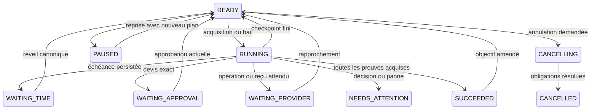

# Étape 3 — Coordination autonome et apprentissage

Contrat du 2026-10-06. La portée est l'étape 3 du plan en quatre étapes : plans validés, coordinateur Strands borné, progression durable, routines et réveils, révision des objectifs, apprentissage sourcé et notifications. Les canaux voix et MCP restent à l'étape 4.

L'implémentation est réalisée dans le worktree isolé `koyori-etape3/Koyori`, branche `gus-rlin/koyori-etape3`. Le commit `fb5f310` conserve une copie de l'étape 2 telle qu'elle existait au démarrage, encore non commitée dans le checkout d'origine à ce moment. Ce checkout a évolué indépendamment pendant la tâche ; comparer ses corrections avant intégration. Cette tâche n'y a modifié ni fichiers ni état Git.

Les plans utilisent le registre de capacités et les devis des connecteurs. Une sortie de modèle ne constitue ni une autorisation, ni une approbation, ni un reçu. Les simulations et tests de contrats sont identifiés séparément des qualifications distantes.

## Réalité de la livraison

| Élément | Implémentation et preuve | Limite actuelle |
| --- | --- | --- |
| Objectif naturel, plan, dépendances, décisions | API et progression transactionnelle dans `goals.py`, `plans.py`, `stage3_contracts.py` | Les recettes locales utilisent un planificateur FR/EN déterministe explicitement simulé |
| Coordinateur Strands/Nova | Strands 1.57.2 réellement exécuté en test, transport Converse intercepté ; adaptateur Bedrock prêt | Aucun appel Nova distant effectué ; qualification opt-in disponible |
| Spécialistes | Lecteurs mémoire et agenda produisant `SpecialistResult`, devis et reçus via les connecteurs existants | Aucun agent généraliste supplémentaire ni outil shell ; compte Google réel encore non qualifié |
| Reprise, attentes, modifications | `GOALRUN`, baux, checkpoints et actions canoniques, recettes MemoryStore/DynamoDB Local/Docker | Cohérence distribuée et exécution AWS à qualifier |
| Step Functions Standard et Scheduler | Adaptateurs idempotents, CDK synthétisé et assertions de permissions | Ressources distantes non créées |
| Routines et apprentissage | API, règles civiles et occurrences versionnées ; acceptation explicite et révision de mémoire | Apprentissage sous forme de propositions sourcées ; aucun entraînement du modèle |
| Activité et notifications | Enveloppes privées minimales, groupes durables et horaires de calme | Flux HTTP seulement ; transport push/vocal prévu à l'étape 4 |

## Plans et contexte

Un `POST /v1/goals` enregistre un objectif privé, son propriétaire issu du JWT, sa génération d'accès et une intention de run dans la même transaction. Le texte est borné à 2 000 caractères ; les clés de contexte sont optionnelles et limitées à huit. Les objectifs partagent le plafond existant de 32 tâches actives par foyer.

Le plan contient une disposition (`ready`, `needs_attention`, `unsupported`), un résumé, des références avec révision et jusqu'à douze étapes. Chaque étape déclare identifiant, dépendances, capacité, arguments, éventuelle échéance UTC et preuve attendue. Pydantic refuse champs inconnus, outils arbitraires, dépendances absentes, cycles, intentions commerciales dupliquées et plans de plus de 24 Ko. La validation serveur vérifie aussi propriété des comptes, capacités, révisions, échéances futures et horizon de 366 jours. Une réponse limitée ne contient aucune étape d'exécution.

Les quatre capacités admises sont `memory.context`, `calendar.read`, `commerce.meals` et `commerce.groceries`. Les montants, prix, identifiants d'opération et reçus viennent exclusivement des connecteurs. Le résultat mémoire décrit les sources canoniques ; le résultat agenda décrit un instantané borné, et ne constitue pas un engagement commercial.

Le contexte du modèle est limité à 20 Ko : objectif, heure courante, fuseau, au plus quatorze souvenirs et huit comptes autorisés, deux instantanés d'agenda de huit événements, conditions des intentions commerciales existantes. Les extraits d'agenda sont bornés à 300 caractères. Une troncature est signalée ; un contexte incompressible passe en décision explicite. Secrets OAuth, clés fournisseur, grants, tokens et logs privés sont exclus. Les champs mémoire/agenda restent des données non fiables, distinguées des instructions système.

La découverte des comptes parcourt au plus cinq pages de cent connexions canoniques, puis conserve huit comptes actifs du propriétaire avec l'époque d'accès actuelle. Les historiques révoqués et les autres membres ne monopolisent plus la première page. Un curseur restant ou plus de huit comptes admis produit `connectionsTruncated=true`, également reflété dans `contextTruncated`. La simulation demande alors de préciser le contexte si elle ne trouve pas le fournisseur ; elle n'affirme pas que le compte est absent. Cette borne de 500 enregistrements est une limite de découverte explicite, pas un plafond de connexions persistées.

Le contexte durable réunit les sources du prompt, toutes les références déclarées du plan accepté et celles découvertes par les lecteurs, jusqu'à 24 références uniques. Une référence validée à un agenda autorisé reste surveillée même lorsqu'il n'appartient pas aux deux instantanés du prompt. Le checkpoint et les nouvelles lignes `PLANDEP` sont atomiques ; une révision déjà utilisée ne peut être remplacée par une lecture plus récente. La promotion valide toutes les références et borne la transaction à cent clés uniques. Dépasser une de ces bornes rend `NEEDS_ATTENTION` avec `PLAN_SOURCE_LIMIT` ou `PLAN_TRANSACTION_LIMIT`, sans checkpoint partiel ni envoi fondé sur des sources ignorées.

Les plans acceptés et leurs versions sont conservés sous `PLAN#<taskId>#<revision>` dans `Domain`, avec version du prompt/schéma, modèle, région et usage de tokens retourné par le SDK. Cette petite représentation permet la promotion atomique du plan, de ses dépendances et du checkpoint ; elle remplace la proposition de stockage S3 des candidats du TDD pour ce périmètre borné. Aucune chaîne de raisonnement n'est conservée.

## Raisonnement borné et tentatives finies

Un nouvel agent Strands est construit par proposition, sans historique caché ni outils d'exécution. Seule la sortie structurée `Plan` est exposée au modèle. Converse utilise 4 096 tokens de sortie au maximum, un timeout réseau de vingt secondes et une tentative Botocore. Les retries automatiques Strands sont désactivés. Une sortie invalide peut être réparée une fois. Un compteur durable est réservé juste avant chaque requête HTTP Converse, y compris les éventuelles tentatives internes de structuration.

Limites par défaut : deux requêtes de modèle par proposition avec sa réparation, seize par objectif sur toute sa vie, deux cents par personne/foyer/jour UTC. Les limites configurables restent bornées (objectif 2–64, quotidien 1–10 000). Une panne, un throttle ou l'épuisement du quota produit `NEEDS_ATTENTION` ; le même événement tardif ne relance pas indéfiniment le modèle. Le budget de raisonnement ne bloque jamais le rapprochement indépendant des actions `DISPATCHING`/`UNKNOWN`.

Chaque run acquiert un bail de 120 secondes et une nouvelle génération. Il effectue une proposition, au plus deux lectures indépendantes, un devis, une réservation ou un rapprochement, puis sauvegarde un checkpoint et libère le bail. Le plan peut réduire les limites à un lecteur ou moins de huit outils par passe. Les étapes restantes sont persistées ; les writes passent par les mêmes transactions de budget même pour deux objectifs différents.



L'exécution AWS est une Step Functions **Standard** finie avec une seule invocation Lambda, sans boucle `Wait` ni retry de modèle. Son nom et son input immuable dérivent des IDs et de `runEpoch` et sont persistés avant le démarrage. Après crash entre StartExecution et sauvegarde, DescribeExecution rapproche le même nom/input. Une exécution encore `RUNNING` empêche la reprise concurrente d'un bail expiré. Le payload contient seulement foyer, tâche et génération ; les logs du workflow excluent les données d'exécution.

## Événements, modifications et autorité

Une correction mémoire ou un changement agenda/connexion découvre les plans liés via l'index dérivé `PLANDEP`, puis relit tâche et version canoniques. Avant réservation et juste avant dispatch, la mémoire, les droits, les conditions du devis, le budget et la règle de routine sont relus et gardés dans la transaction. Même si l'événement de correction manque ou l'index est retardé, les conditions périmées ne justifient pas un nouvel envoi.

L'agenda possède une révision de contenu `CALVERSION`, distincte de la révision des droits de connexion. Elle avance dans la transaction de synchronisation uniquement lorsque le contenu visible ou la génération complète change. Une synchronisation sans changement n'entraîne pas de nouveau raisonnement. Les états de synchronisation doivent être complets et sont gardés avant promotion/réservation/dispatch ; un agenda partiel n'est pas présenté comme vide. Lors d'une mise à jour depuis l'étape 2, synchroniser chaque connexion existante pour créer sa révision de contenu avant d'activer la coordination.

Les commandes de pause, reprise, amendement et annulation invalident les anciens runs et epochs de dispatch. Une pause bloque une action `READY` avant envoi ; elle ne prétend pas rappeler une requête déjà partie. Le worker d'actions continue le lookup fournisseur et conserve la réservation jusqu'au résultat connu. Une reprise obtient un nouveau plan et de nouveaux devis. Une intention jamais exécutée peut être réutilisée uniquement si le registre prouve `BLOCKED`/`REJECTED`, version fournisseur zéro, sans action ni dépense engagée.

Le retrait puis la réadmission du propriétaire ne réautorise pas un ancien objectif. Une époque différente terminalise cet objectif en `FAILED / ACCESS_REVOKED`, libère son quota une seule fois et ferme son dispatch. Les opérations déjà parties restent suivies par le registre d'actions indépendant.

Une modification conserve `intentKey`, l'intention et le compte commercial. Les achats déjà engagés omis ou déplacés vers un autre compte nécessitent une résolution explicite. Avant toute replanification, les opérations anciennes `READY`/`DISPATCHING`/`UNKNOWN` sont résolues. Si l'achat est confirmé, un panier différent produit une opération `modify` sur la même commande ; des conditions identiques réutilisent le reçu. Le simulateur comprend aussi une correction courte telle que « Finalement nous serons quatre » à partir des conditions existantes.

Les devis liés à un objectif ne peuvent être exécutés par `POST /v1/actions` pour contourner un objectif en pause. Une approbation de dépense est toujours créée via le step-up existant, puis rattachée à l'étape et au devis actuels par `/decisions`. L'annulation demandée par le propriétaire peut poursuivre la résolution d'une obligation même si le budget a été désactivé ; elle n'autorise aucune nouvelle dépense. `CANCELLED` exige un reçu d'annulation ou la preuve qu'aucune obligation n'existe. Une livraison déjà passée, un compte révoqué ou un résultat fournisseur non résolu demande une intervention.

## Réveils et routines

Les réveils sont des intentions durables de `Delivery`. `fireAt` indique l'échéance réelle ; `dueAt` indique la prochaine tentative de création/réparation. La création Scheduler a un nom et un token stables, un `at` UTC sans fenêtre flexible, un payload limité au `wakeId` et une suppression après achèvement. Un conflit de création vérifie expression et cible ; la suppression est idempotente et réparable séparément. Le sweep recharge les records canoniques et livre les échéances manquées, même sans notification Scheduler.

Une routine est une demande naturelle, un fuseau IANA, une heure civile `HH:MM`, des jours de semaine (lundi=0), une période bornée à 366 jours et une version. Les dates sont converties en UTC après vérification aller-retour du fuseau. Une heure inexistante au printemps est ignorée ou refusée selon `nonexistentTime`; une heure doublée en automne choisit `ambiguousTime=first|second`. Le choix est conservé dans la règle. Une occurrence s'identifie par règle, version et date/heure locale, et crée sa tâche dans la même transaction que le marqueur `OCCURRENCE`.

Le quota de 32 routines actives par foyer inclut celles en pause ; annulation et dernière occurrence libèrent la place. Une intention indépendante `RULECHECK` contrôle les droits et l'horizon tous les 120 secondes, avec les mêmes réparations conditionnelles et lots bornés. Elle survit à la suppression du réveil lors d'une pause : perte d'autorité ou jour local au-delà de `endsOn` désactive la règle et libère sa place une seule fois, sans créer d'occurrence. Les anciens réveils concernés sont supprimés de façon réparable. Le délai de détection dépend du sweep et de son lot disponible ; il ne remplace pas le contrôle synchrone avant un envoi.

Exception de reprise : une règle encore active, non suspendue et autorisée conserve la livraison unique de son dernier réveil déjà persisté, même après le dernier jour. Le contrôle appelle alors la livraison canonique, qui crée l'occurrence et libère le quota dans la même transaction. Une course entre contrôle et livraison retrouve le même marqueur d'occurrence ; les règles suspendues, remplacées ou révoquées n'utilisent pas cette exception.

Modifier, suspendre ou supprimer une règle invalide son ancien réveil et bloque les nouveaux envois de ses anciennes occurrences. Les opérations déjà envoyées restent rapprochées. Une ancienne occurrence suspendue ne reprend pas silencieusement avec une autre version de règle. La remise en route d'une règle crée ses prochaines occurrences.

Politique de retard : l'occurrence déjà persistée est traitée une fois, puis la prochaine occurrence est calculée à partir de l'heure actuelle. Les journées intermédiaires sans intention persistée ne produisent pas une série d'achats rétroactifs. Une erreur par réveil est différée avec backoff sans bloquer tout le lot.

## Apprentissage et notifications

`POST /v1/learning` crée une proposition privée de préférence ou de procédure, avec source déclarée ou objet canonique, révision source et expiration à sept jours. L'acceptation/rejet exige la révision de la proposition et sa génération d'accès actuelle. Une correction peut nommer `targetMemoryId` et `targetRevision` ; le CAS empêche d'écraser une autre correction. Les procédures restent des listes déclaratives de capacités existantes. L'acceptation modifie la mémoire, jamais politiques, budget, partage, consentement ou comptes. Une envie ponctuelle reste un échange tant qu'une proposition n'est pas acceptée.

Les prochaines propositions de plan utilisent la mémoire actuelle. Corriger ou effacer le souvenir change la projection d'une proposition acceptée et invalide les conditions concernées des plans. Cette livraison expose le contrat de proposition/acceptation ; elle n'ajoute ni fine-tuning ni extraction automatique de toute conversation. Le futur canal vocal pourra produire ces mêmes propositions.

Les changements de tâche, routine et proposition produisent des enveloppes d'activité sans corps privé. Les notifications regroupent les IDs par personne et intervalle ; un groupe contient seize objets, avec débordement dans un nouveau groupe (64 groupes au maximum par intervalle, rejet explicite au-delà). Les horaires de calme sont relus avant livraison, avec fuseau et DST. Aucun contenu métier n'est recopié dans les intentions de notification. La lecture du flux relit propriétaire, génération d'accès et état courant. En absence de transport externe, `DELIVERED` signifie disponible dans `/v1/notifications`.

## Contrat HTTP

Toutes les routes utilisent identité personnelle, foyer authentifié, clé d'idempotence et droits actuels. Les objets de l'étape 3 sont privés au propriétaire. Les mutations d'objets existants exigent `If-Match` ; les listes utilisent les curseurs chiffrés/signés existants.

| Route | Corps et résultat |
| --- | --- |
| `POST /v1/goals`, `GET /v1/goals/{id}`, `GET /v1/goals` | `text`, `memoryKeys` ; `202` durable, plan/étapes/actions accessibles au propriétaire |
| `PATCH /v1/goals/{id}` | Nouvel objectif naturel, `memoryKeys` ; nouvelle révision et replanification |
| `POST /v1/goals/{id}/pause|resume|cancel` | Aucun argument métier ; `202` et état actuel |
| `POST /v1/goals/{id}/decisions` | `stepId`, `approvalId` ; `202`, devis exact et approbation non consommée |
| `POST /v1/routines`, `GET /v1/routines[/{id}]` | `text`, `memoryKeys`, `timeZone`, `localTime`, `weekdays`, `startsOn`, `endsOn`, `ambiguousTime`, `nonexistentTime` |
| `PATCH /v1/routines/{id}`, `POST /pause|resume`, `DELETE /v1/routines/{id}` | Nouvelle règle complète, contrôle sans arguments ou annulation |
| `POST /v1/learning`, `GET /v1/learning[/{id}]` | `kind`, `text`, `key`, `source`, `steps` ; cible/révision optionnelles pour correction |
| `POST /v1/learning/{id}/decisions` | `decision=accept|reject` ; mémoire résultante si acceptée |
| `GET/PUT /v1/notification-policy` | `timeZone`, `quietStart`, `quietEnd`, `groupSeconds` ; création avec `If-Match: "0"` |
| `GET /v1/notifications` | Groupes livrés et objets actuellement visibles ; pagination |

Exemple de corps : `{"text":"Prépare le dîner pour deux demain à 20 h","memoryKeys":["dinner"]}`. Il nécessite un compte de commerce simulé et un budget déjà configuré ; à défaut, Koyori rend l'indisponibilité ou la décision explicite. `202` n'est jamais un reçu fournisseur.

Un fuseau IANA inconnu est refusé avec HTTP `422` sur les routines et la politique de notifications.

## Configuration et qualification

| Variable | Valeur / usage |
| --- | --- |
| `KOYORI_PLANNING_MODE` | `simulated` en local par défaut, `disabled` sans configuration distante, `aws` explicitement |
| `KOYORI_PLANNING_REGION`, `KOYORI_PLANNING_MODEL` | Source `us-east-1` par défaut ; profil accepté `us.amazon.nova-2-lite-v1:0`, régions source US admises par le code |
| `KOYORI_PLANNING_DAILY_LIMIT`, `KOYORI_REASONING_TASK_LIMIT` | 200 / 16 par défaut |
| `KOYORI_COORDINATOR_MACHINE_ARN` | Dispatch Step Functions lorsque défini ; runs locaux directs sinon |
| `KOYORI_CALENDAR_READER_ARN` | Lecture d'agenda déléguée au rôle connecteur, sans donner les credentials au coordinateur |
| `KOYORI_SCHEDULER_GROUP`, `KOYORI_SCHEDULER_ROLE_ARN`, `KOYORI_SCHEDULER_TARGET_ARN` | Cible et rôle fixes Scheduler ; absent en local |

Le CDK configure le planificateur AWS et les permissions du profil US. Cette configuration peut impliquer un transfert de contexte hors de la région métier européenne ; décider consentement/région et qualifier le profil avant utilisation avec des données personnelles. La région et les crédits du concours ne sont pas supposés validés.

```powershell
uv run python scripts/verify_stage3.py
uv run python scripts/qualify_planner.py                 # NOT_RUN explicite
uv run python scripts/qualify_planner.py --live          # jusqu'à 16 requêtes Bedrock facturables
```

La qualification opt-in utilise huit fixtures FR/EN en mémoire, dont sources hostiles, compte absent et capacité non supportée. Elle n'exécute aucun achat et enregistre appels, tokens et temps réellement observés. Le contrôle du 2026-10-06 renvoie `NOT_RUN / aws_credentials_unavailable` : aucun score de qualité du modèle réel ni coût AWS observé. Voir [rapport](verification/nova-qualification.json). La revue de code et les tests avec transport intercepté ne remplacent pas cette qualification.

Sources officielles consultées le 2026-10-06 : [Strands — exploitation](https://strandsagents.com/docs/user-guide/sdk/deploy/operating-agents-in-production/), [Nova 2 Lite](https://docs.aws.amazon.com/bedrock/latest/userguide/model-card-amazon-nova-2-lite.html), [types de programmes Scheduler](https://docs.aws.amazon.com/scheduler/latest/UserGuide/schedule-types.html), [CreateSchedule](https://docs.aws.amazon.com/boto3/latest/reference/services/scheduler/client/create_schedule.html), [StartExecution](https://docs.aws.amazon.com/step-functions/latest/apireference/API_StartExecution.html).

## Limites et suite

Les capacités sont celles du manifeste ; les services sans connecteur restent limités. Le commerce simulé ne garantit aucun comportement d'un marchand réel. Le planificateur local est une fixture de recette, dont la compréhension linguistique est volontairement restreinte. Cognito, Google, Nova, IAM, Scheduler et Step Functions nécessitent encore une qualification distante. Aucun serveur MCP ni intégration Alexa+ native n'est livré ici.

Les historiques de plans et propositions restent soumis à la stratégie de rétention/effacement complète de l'étape 4 : la suppression masque les projections et les sources actuelles, mais ne démontre pas un effacement physique des sauvegardes et de toutes les anciennes versions de plan. Les preuves finales et le score de revue sont dans [verification/stage3.md](verification/stage3.md) et [JOURNAL.md](../JOURNAL.md).
